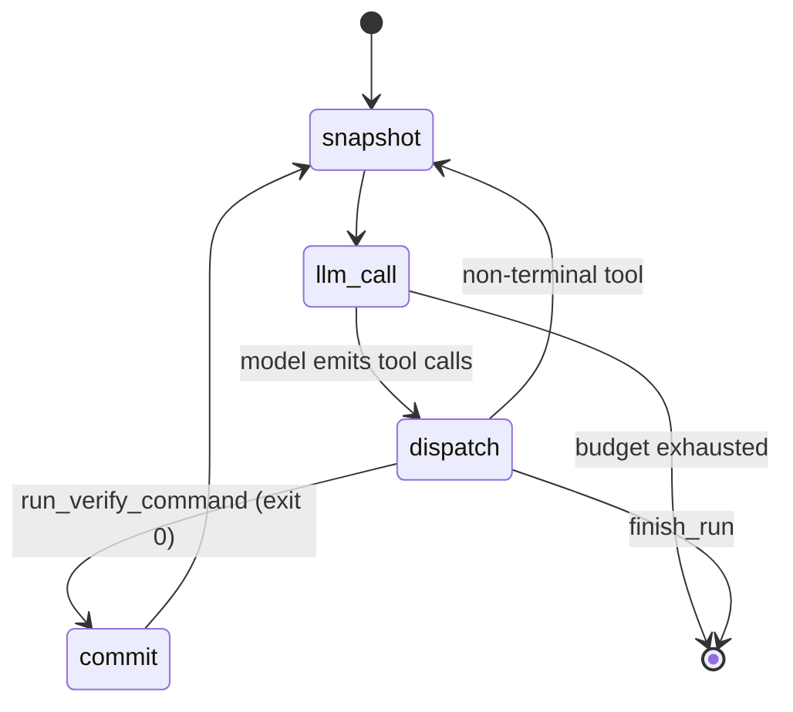
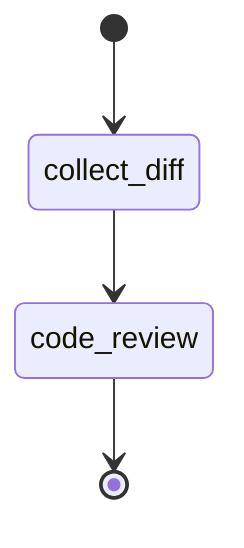
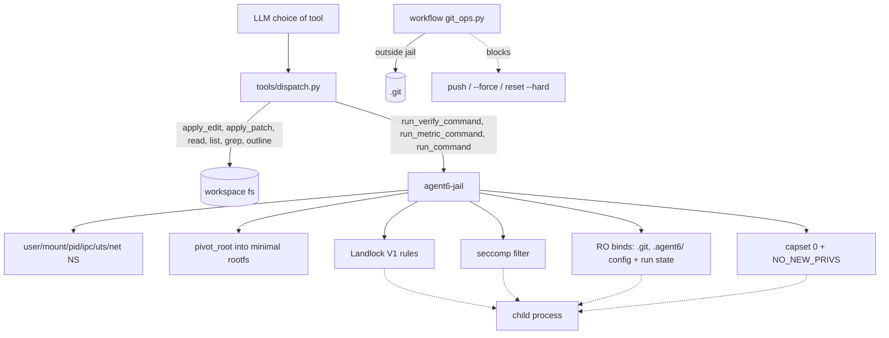
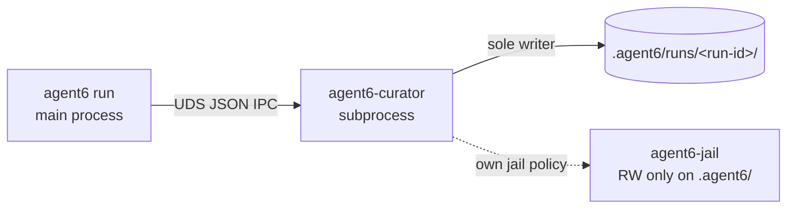

# Architecture

This document is a map of how agent6 runs end-to-end. The diagrams
are mermaid (`mermaid` fenced blocks render natively on GitHub). For
per-file conventions and stability rules see [AGENTS.md](AGENTS.md).
For the security model — threat model, defense layers, sandbox profiles —
see [SECURITY.md](SECURITY.md).

## Layering

```
cli  ──▶  workflows  ──▶  agents  ──▶  tools  ──▶  sandbox
                              │
                              └─▶ providers (anthropic | openai)
```

Boundaries are enforced by [tach](https://docs.gauge.sh/) (see
[tach.toml](tach.toml)). Workflows never import each other; agents never
import workflows or the CLI. Crossing a boundary is almost always a
sign of the wrong design.

- **cli** ([src/agent6/cli/](src/agent6/cli/)) — argument parsing,
  optional TUI spawn, top-level dispatch. Picks a workflow. Config is
  resolved by [config_layer.py](src/agent6/config_layer.py) (built-in
  secure defaults < global `~/.config/agent6/config.toml` < per-repo
  `.agent6/config.toml` < `--config FILE`), with paths + sudo/root
  resolution in [paths.py](src/agent6/paths.py) and API keys in
  [secrets.py](src/agent6/secrets.py). The in-repo directory name
  (`.agent6` by default — config and run state together) is settable via
  the global-only `[agent6].workspace_subdir`. Roles: `worker` drives
  `run`/`resume`, `planner` drives `plan` (falls back to `worker`),
  `reviewer` drives `review` + the in-loop critic.
- **workflows** ([src/agent6/workflows/](src/agent6/workflows/)) — two
  exist: `loop` (the agent loop driving `agent6 run` / `agent6 resume`)
  and `review` (the read-only review pass driving `agent6 review`).
- **agents** ([src/agent6/agents/](src/agent6/agents/)) — single-turn
  LLM call shapes. The only one is `code_review`; the agent loop makes
  its own provider calls inline.
- **tools** ([src/agent6/tools/](src/agent6/tools/)) — the fixed,
  audited tool surface the LLM sees, plus dispatch.
- **sandbox** ([src/agent6/sandbox/](src/agent6/sandbox/)) — Landlock
  on the agent process, `agent6-jail` for children.

## Workflow: `run`

This is the agent. One provider, one model, one message history. The
model drives by calling tools; the workflow dispatches tools, snapshots
state, and tracks budget.



Notes:

- **One LLM, one history, one loop.** No planner→worker handoff, no
  critic step, no separate reviewer agent. Multi-step work is the
  model calling the next tool in the same conversation.
- **Snapshot before every LLM call.** A `snapshots/<step>.json` is
  written to `.agent6/runs/<run-id>/` before each provider request.
  `agent6 resume <run-id>` rehydrates from the latest snapshot;
  combined with the per-tool transcripts under `transcripts/`, any
  interrupted run can be replayed deterministically up to the model
  call that comes next.
- **Per-step commits** fire when `run_verify_command` returns 0, via
  `git_ops.py` from outside the jail. Per-step is the default; the
  `git.commit_strategy` knob also allows `squash` (one commit at run
  end), `stage` (stage but never commit), and `none`.
- **DAG-as-tool.** `dag_add_task` / `dag_update_task` /
  `dag_set_cursor` / `dag_list_tasks` write to a curator-owned side
  store. They do not gate the loop; they are notes the worker keeps
  for itself and the user.
- **Context compaction.** Long runs are kept inside the model's context
  window in two tiers (thresholds in `[workflow]`): at
  `compact_drop_at_chars` the oldest tool_results are replaced by a
  short "re-call if needed" placeholder; at `compact_summarise_at_chars`
  the elided history is summarised by the `reviewer` model and the
  conversation restarts from (task + summary). The curator-owned task
  DAG survives the restart, so the worker recovers task-level state with
  `dag_list_tasks` instead of starting over.
- **`finish_run(summary)`** is the only terminal tool. Calling it
  emits a `run.end` event and returns control to the CLI.

## Workflow: `review`

A single read-only pass ([src/agent6/workflows/review.py](src/agent6/workflows/review.py))
over a diff (working tree, branch-vs-base, or arbitrary range) using
the `agents/code_review.py` agent. Produces structured findings; no
edits, no commits, no `run_command`.



## Enforcement layering

[SECURITY.md](SECURITY.md) details which guarantee each layer provides.
As a diagram:



Two things are worth calling out:

- `git_ops.py` runs **outside** the jail (the agent's own process), so
  the RO bind of `.git` does not stop the workflow from committing. It
  stops the worker.
- `protect_git` / `protect_agent6` work in both profiles. Strict uses
  a bind-remount-RO on top of the workspace mount. Hardened (no
  mount namespace) switches its Landlock setup from "RW on cwd" to
  "R on cwd + RW on each top-level entry except the protect set".
  Same end result for paths present at jail-launch time; hardened
  additionally denies writes to *new* top-level entries created at
  the cwd root (anything inside an existing top-level dir is
  unaffected by the carve-out).

## Curator subprocess

Run state (graph + transcripts + logs) is owned by a separate
`agent6-curator` subprocess, not by the main agent process.



The agent talks to the curator over a Unix domain socket. The curator
runs under its own jail policy that allows writes only to `.agent6/`.
This means even a bug in the agent process cannot scribble over the
run directory in an unsafe way; the curator validates every IPC frame
against a pydantic schema before applying it.

## Run state on disk

Each run's directory `.agent6/runs/<run-id>/` holds:

- `graph.jsonl` — append-only journal of every task-graph mutation.
- `graph.dot` — current task graph, regenerated atomically.
- `nodes/*.md` — one markdown file per task node, rewritten atomically.
- `logs.jsonl` — the structured event stream (below).
- `snapshots/` — per-tool-call JSON snapshots that drive `agent6 resume`.
- `transcripts/` — full provider request/response pairs for replay.

The `logs.jsonl` vocabulary is small and stable — the data contract for
any external viewer (the fold to UI state lives in
[src/agent6/ui/state.py](src/agent6/ui/state.py) as a pure function):

| Event                       | Notable fields                              |
| --------------------------- | ------------------------------------------- |
| `run.start`                 | `user_task`                                 |
| `tool.call` / `.result`     | `name`, `args` (preview), `ok`, `summary`   |
| `verify.start` / `.end`     | `cmd`, `exit_code`, `duration_s`, `*_tail`  |
| `role.call` / `.result`     | `role`, `model`, `tokens_in`, `tokens_out`  |
| `role.text_delta`           | streamed assistant text chunk               |
| `budget.update`             | totals + caps for input/output tokens       |
| `approval.prompt`/`.answer` | `id`, `prompt`, `approved`, `source` (`tui`/`stdin`) |
| `loop.*`                    | agent progress: `loop.auto_commit`, `loop.compact.*`, `loop.critic.*`, `loop.metric.*`, `loop.steer.*` |
| `run.end`                   | `summary`                                   |

A `run_command` approval is published as `approval.prompt`; the dashboard
TUI shows an Allow/Deny modal and writes `approvals/<id>.answer`, which the
workflow reads (falling back to a stdin prompt with no TUI), then records
`approval.answer`. The task DAG is **not** in this stream — it is
curator-owned and lives in `graph.jsonl` (read via `agent6 history
graph`).

## Where things live

| Concern                          | File / dir                                                            |
| -------------------------------- | --------------------------------------------------------------------- |
| Config schema                    | [src/agent6/config.py](src/agent6/config.py)                          |
| Tool surface                     | [src/agent6/tools/schema.py](src/agent6/tools/schema.py)              |
| Tool dispatch                    | [src/agent6/tools/dispatch.py](src/agent6/tools/dispatch.py)          |
| agent loop                       | [src/agent6/workflows/loop.py](src/agent6/workflows/loop.py)          |
| Review workflow                  | [src/agent6/workflows/review.py](src/agent6/workflows/review.py)      |
| Code-review agent                | [src/agent6/agents/code_review.py](src/agent6/agents/code_review.py)  |
| Jail launcher (Python wrapper)   | [src/agent6/sandbox/jail.py](src/agent6/sandbox/jail.py)              |
| Jail launcher (Rust binary)      | [src/agent6/jail/src/main.rs](src/agent6/jail/src/main.rs)            |
| Git policy                       | [src/agent6/git_ops.py](src/agent6/git_ops.py)                        |
| Provider clients                 | [src/agent6/providers/](src/agent6/providers/)                        |
| Knowledge graph (curator)        | [src/agent6/graph/](src/agent6/graph/)                                |
| Event log + UI fold              | [src/agent6/events.py](src/agent6/events.py), [src/agent6/ui/](src/agent6/ui/) |
| Run state on disk                | `.agent6/runs/<run-id>/`                                              |

## Pre-1.0 stability

See [AGENTS.md](AGENTS.md). Until 1.0 every public shape (config TOML,
IPC frames, on-disk graph, CLI flags, transcript layout) is liquid;
we break cleanly rather than carry shims.
