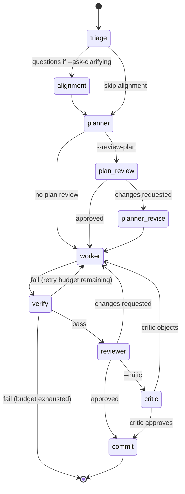
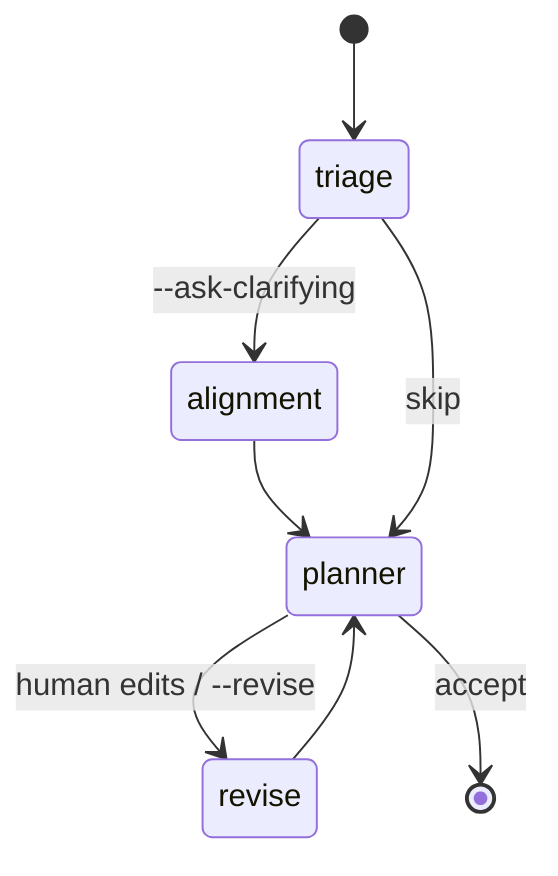
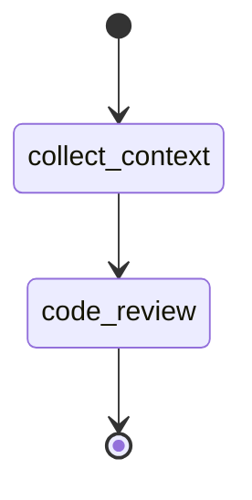
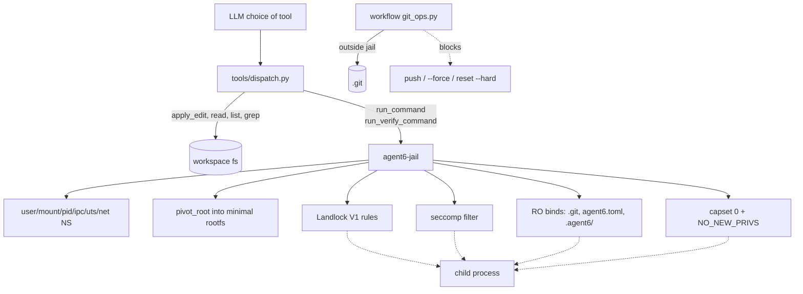

# Architecture

This document is a map of the workflows agent6 runs. It is hand-written;
the diagrams are mermaid (`mermaid` fenced blocks render natively on
GitHub). For per-file conventions and stability rules see
[AGENTS.md](AGENTS.md). For the security model see [SECURITY.md](SECURITY.md)
and the threat model section of [README.md](README.md).

## Layering

```
cli  ──▶  workflows  ──▶  agents  ──▶  tools  ──▶  sandbox
                              │
                              └─▶ providers (anthropic | openai)
```

Boundaries are enforced by [tach](https://docs.gauge.sh/) (see
[tach.toml](tach.toml)). Workflows never import each other; agents never
import workflows or the CLI. Crossing a boundary is almost always a
sign of the wrong design.

- **cli** ([src/agent6/cli.py](src/agent6/cli.py)) — argument parsing,
  TUI, top-level dispatch. Picks a workflow.
- **workflows** ([src/agent6/workflows/](src/agent6/workflows/)) — the
  finite state machines that drive a run end-to-end. Three exist:
  `implement`, `plan_mode`, `review`.
- **agents** ([src/agent6/agents/](src/agent6/agents/)) — single-turn
  LLM roles (planner, worker, reviewer, critic, alignment, triage,
  summarizer, code_review). Each agent is one call shape.
- **tools** ([src/agent6/tools/](src/agent6/tools/)) — the fixed,
  audited tool surface the LLM sees, plus dispatch.
- **sandbox** ([src/agent6/sandbox/](src/agent6/sandbox/)) — Landlock
  on the agent process, `agent6-jail` for children.

## Workflow: `implement`

This is the default workflow ([src/agent6/workflows/implement.py](src/agent6/workflows/implement.py)).
It is the only one with a non-trivial state machine.



Notes:

- The transitions marked `--ask-clarifying`, `--review-plan`,
  `--critic` are conditional on CLI flags / config; without them the
  workflow short-circuits to the next state.
- `verify --> worker` is bounded by `[budget].verify_retries` in
  config. Going over exits the run with a failure.
- `reviewer --> worker` is bounded by `[budget].review_rounds`.
- Every LLM call goes through `agents/_common.py` for retry +
  transcript logging. Every tool call goes through `tools/dispatch.py`.

## Workflow: `plan_mode`

A linear refine loop ([src/agent6/workflows/plan_mode.py](src/agent6/workflows/plan_mode.py)).
No worker, no verify, no commit — the output is a plan file the human
edits and feeds back into `implement`.



## Workflow: `review`

A single read-only pass ([src/agent6/workflows/review.py](src/agent6/workflows/review.py))
over a diff or a path. Produces structured findings; no edits, no
commits.



## Enforcement layering

The threat model in [README.md](README.md) summarizes which guarantee
each layer provides. As a diagram:



Two things are worth calling out:

- `git_ops.py` runs **outside** the jail (the agent's own process), so
  the RO bind of `.git` does not stop the workflow from committing. It
  stops the worker.
- `protect_git` / `protect_agent6` work in both profiles. Strict uses
  a bind-remount-RO on top of the workspace mount. Hardened (no
  mount namespace) switches its Landlock setup from "RW on cwd" to
  "R on cwd + RW on each top-level entry except the protect set".
  Same end result for paths present at jail-launch time; hardened
  additionally denies writes to *new* top-level entries created at
  the cwd root (anything inside an existing top-level dir is
  unaffected by the carve-out).

## Where things live

| Concern                          | File / dir                                 |
|----------------------------------|--------------------------------------------|
| Config schema                    | [src/agent6/config.py](src/agent6/config.py) |
| Tool surface                     | [src/agent6/tools/schema.py](src/agent6/tools/schema.py) |
| Tool dispatch                    | [src/agent6/tools/dispatch.py](src/agent6/tools/dispatch.py) |
| Jail launcher (Python wrapper)   | [src/agent6/sandbox/jail.py](src/agent6/sandbox/jail.py) |
| Jail launcher (Rust binary)      | [jail/src/main.rs](jail/src/main.rs)        |
| Git policy                       | [src/agent6/git_ops.py](src/agent6/git_ops.py) |
| Provider clients                 | [src/agent6/providers/](src/agent6/providers/) |
| Knowledge graph (sidecar)        | [src/agent6/graph/](src/agent6/graph/)     |
| Transcripts on disk              | `.agent6/transcripts/`                     |

## Pre-1.0 stability

See [AGENTS.md](AGENTS.md). Until 1.0 every public shape (config TOML,
IPC frames, on-disk graph, CLI flags, transcript layout) is liquid;
we break cleanly rather than carry shims.
