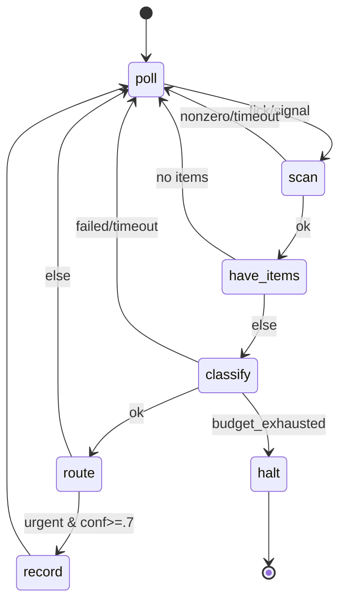

# agent6 state machines

agent6 state machines are a declarative, human-editable, machine-parseable
layer on top of agent6 that lets operators compose *mini-agents* — small,
reliable, deterministic programs whose building blocks are agent6 runs,
sandboxed tool calls, timed waits, and branches.

This document is the specification and reference for the format and its
runtime. The feature is implemented end-to-end under `src/agent6/machine/`
and exposed through the `agent6 machine` subcommands — `create`, `check`,
`graph`, `run`, `status`, `poke`, and `replay` (§7). It does not change
the security model, the tool surface, or the stability policy in
[AGENTS.md](AGENTS.md); §9 records how each invariant is preserved.

---

## 1. Motivation

Today agent6 has exactly two workflows ([ARCHITECTURE.md](ARCHITECTURE.md)):

- `run` — one LLM, one history, one loop, driven by the model calling
  tools until `finish_run`.
- `review` — a single read-only pass over a diff.

Both are *single-shot*: you start them, they finish, you read the
result. There is no first-class way to express **a program that runs
indefinitely**, reacting to the clock or to external signals, making
*branching* decisions, looping, and occasionally invoking an agent run
as one step among many.

People reach for tools like "always-on" autonomous agents (the
open-claw / 24-7-daemon genre) for exactly this. Those tools tend to be
unreliable and non-deterministic: an LLM is in the driver's seat of the
*control flow*, not just the *work*, so the same inputs produce
different paths, crashes lose state, and you cannot replay or backtest a
run.

agent6 is unusually well-positioned to do this *better* because the
`run` workflow is already a deterministic, snapshot-and-replay state
machine internally. State machines **lift that pattern up one layer**:
the operator authors the control flow as a static graph, and the LLM
stays confined to the work *inside* a state.

### Example use case (illustrative, out of scope to ship)

> Poll a watched location on a fixed interval. When new items appear,
> have an agent classify each one into a typed verdict. On a
> high-confidence verdict, take a side-effecting step (record it,
> archive it, notify) and loop. Otherwise wait and poll again.

Whatever the watched location and the side effect actually *are* is
**out of scope** here — anything that talks to the outside world would
be a new, separately-audited tool, which the security invariants gate by
default. The point is the *shape*: a long-running loop with an initial
state, timed polling, branches on classification output, side-effecting
steps, and terminal states. That shape is what state machines make
first-class.

---

## 2. Goals and non-goals

### Goals

1. **Human-editable.** An operator authors a machine in a text editor.
   The format is obvious to read, diff-friendly, and commentable.
2. **Deterministically parseable.** One file → exactly one validated
   in-memory machine, or a precise error. No ambiguity, no implicit
   defaults beyond the ones declared in the file.
3. **Deterministic execution / replayable.** Given the same journal of
   inputs (including captured wall-clock and external reads), re-running
   reproduces the identical path. You can backtest a run offline.
4. **Reliable / crash-safe.** Kill the process at any point; on restart
   it rehydrates from an append-only journal at the last completed
   state and the next scheduled wake. Idempotent: completed
   side-effecting steps are not re-run.
5. **Composable.** A state can *be* an agent6 run. Mini-agents are built
   by wiring states, not by writing Python.
6. **Confined.** The LLM never authors control flow and never gains new
   tool surface. All side effects still route through the existing jail.

### Non-goals

- Not a general programming language. The branch/predicate grammar is
  intentionally **non-Turing-complete** (no loops *inside* a predicate,
  no arbitrary code). Loops exist only as graph edges.
- Not a distributed scheduler. One machine = one OS process (systemd /
  cron-friendly), restartable. No clustering in v1.
- Not a new network surface. Anything that talks to the outside world
  is a *tool*, gated by the existing audit rules.
- Not LLM-authored. Machines are operator artifacts checked into a repo.

---

## 3. Design principles

- **Control flow is static and operator-owned; work is dynamic and
  model-owned.** The graph of states/edges is fixed at author time. What
  happens *inside* an `agent` state is the usual agent6 loop.
- **Everything nondeterministic is journaled as a fact.** Wall-clock
  reads, tool stdout, agent outputs — each is appended to an immutable
  event log the moment it is observed. The engine is a pure reducer over
  `(machine, blackboard, event) → blackboard'`. Replay reads the journal
  instead of re-observing the world.
- **Fail loudly** (repo convention). A missing transition target, an
  unreachable state, a type mismatch on a blackboard variable, or an
  unknown key is a *load-time* error, not a runtime surprise.
- **No implicit defaults** (mirrors `Config`: `extra="forbid",
  frozen=True`). Every variable is declared with a type and an explicit
  initial value (`value` for `[vars.operator]`, `default` for the
  mutable `[vars.code]`/`[vars.agent]`). Every state declares every
  outcome edge it can produce.

---

## 4. The format

A machine is a single TOML file, suffix `.asm.toml` ("agent6 state
machine"). TOML because the project already standardizes on it, it is
parsed by `tomllib` (stdlib — **no new dependency**), and it is
comfortable to hand-edit and diff. The parsed document is validated by a
pydantic v2 model at the trust boundary (`extra="forbid", frozen=True`),
exactly like `Config`.

> **Naming.** The suffix is `.asm.toml`. The generic, copyable name
> ("agent state machine", deliberately model/vendor-neutral like
> `AGENTS.md`) was chosen over the agent6-specific `.a6m.toml` so the
> format can become a shared convention other tools adopt. If a clash
> with assembly-language `.asm` ever bites in tooling, `.a6m.toml`
> remains the fallback — the parser keys off the doubled extension, not
> the stem.

### 4.1 Top-level shape

```toml
machine = "item-classifier"                # stable id, used in .agent6/machines/<id>/
version = 1                                # schema version; bumped only on real shape changes
initial = "poll"                           # name of the entry state

[budget]
max_usd        = 25.0     # whole-machine spend cap (reuses BudgetTracker)
max_transitions = 100000  # hard stop on total edges taken (runaway guard)

# The blackboard is three subtables, named by WHO may write each variable.
# The subtable header is the owner; there is no per-entry discriminator.
[vars.operator]           # written by the human at author time; immutable at runtime
inbox_dir = { type = "str", value = "/srv/inbox" }
poll_secs = { type = "int", value = 300 }

[vars.code]               # written deterministically by a tool state's capture
pending = { type = "list[str]", default = [] }
cursor  = { type = "str",       default = "" }

[vars.agent]              # written by an agent state's validated finish_run
verdict = { type = "classification", default = {} }  # a [schemas.*] record type

[schemas.<name>]          # named record types; see 4.6
...

[states.<name>]           # one table per state; see 4.3
...
```

### 4.2 The blackboard: three owners

The key/value store is split into three subtables, **named by who may
write each variable**. Provenance is the single organizing axis, and the
subtable header carries it, so there is no redundant per-entry `writer`/
`owner` field. *Who may write a value* is therefore a
statically-checkable, fail-loud property of which table a variable lives
in — not a runtime convention.

| subtable          | written by                                        | mutability        | declared with | example |
|-------------------|---------------------------------------------------|-------------------|---------------|---------|
| `[vars.operator]` | the human, at author time                         | immutable at runtime | `value`    | `inbox_dir`, `poll_secs`, thresholds, an API base |
| `[vars.code]`     | a `tool` state's `capture`                         | mutable (deterministic) | `default` | `pending`, `cursor` |
| `[vars.agent]`    | an `agent` state's validated `finish_run` payload | mutable (LLM)     | `default`     | `verdict` (a `[schemas.*]` record) |

`branch`, `wait`, and `terminal` states never write the blackboard:
`branch` only routes, `wait` only sleeps, `terminal` only ends. Only
`tool` states (into `[vars.code]`) and `agent` states (into
`[vars.agent]`) mutate it. This makes the set of writers small and
fully static.

- **`[vars.operator]`** are the machine's parameters: set once when the
  operator authors/commits the file and **never** written by any state.
  Declared with a concrete `value` (not a `default`). Any `capture`/`set`
  that targets an operator var is a *load-time* error. The names above
  are illustrative — an operator var may be any JSON-serializable value.
- **`[vars.code]`** change only as a pure function of journaled tool
  output — this is what keeps the path deterministic and replayable.
- **`[vars.agent]`** change only through the single validated structured
  output of one `agent` state — the LLM's one sanctioned channel into
  the blackboard.

At `machine check` time the validator enforces the ownership wall: a
`tool` capture may target only `[vars.code]` vars, an `agent` capture
may target only `[vars.agent]` vars, and `[vars.operator]` vars are
read-only to every state. A `tool` cannot smuggle a write into an
LLM-owned variable, and an agent cannot overwrite a deterministic one.

Allowed types (all three subtables): `str`, `int`, `float`, `bool`,
`list[<scalar>]`, `json`, and any **named record type** declared in
`[schemas.*]` (§4.6). The two structured types differ on exactly one
axis — **navigability**:

- `json` is an **opaque** blob: read or written *wholesale* only. It may
  be passed to a tool/agent (`{{ x | json }}`) or captured as a whole,
  but it **may not be dotted**. `x.key` where `x` is `json` is a
  *load-time* error. Use `json` only when the machine never inspects the
  value's internals.
- A **record type** (e.g. `classification`) is **navigable**: every
  `.field` read in a predicate or template is checked against the
  schema at `machine check` time — a misspelled field is a load error,
  not a silent misroute.

Declaring types up front is what makes branch predicates **statically
type-checkable**: scalars by their declared type, record fields by their
schema, and `json` simply forbidden from being dotted at all.

The blackboard (all three subtables) is the *only* state that flows
between states. The mutable halves (`[vars.code]` + `[vars.agent]`) are
snapshotted to disk after every transition; `[vars.operator]` is fixed
for the life of the machine.

### 4.3 State kinds

Every state has a `kind`. There are five.

| kind       | what it does                                              | outcome labels (edges)               |
|------------|-----------------------------------------------------------|--------------------------------------|
| `agent`    | runs one agent6 loop (a `Workflow`) on a prompt           | `ok` · `failed` · `budget_exhausted` · `timeout` |
| `tool`     | one sandboxed command via `run_in_jail`                   | `ok` · `nonzero` · `timeout`         |
| `wait`     | sleeps until a wall-clock tick or an external signal      | `tick` · `signal`                    |
| `branch`   | pure predicate over the blackboard → next state           | (chooses a `goto` directly)          |
| `terminal` | ends the machine                                          | (none — absorbing)                   |

The outcome labels are a **fixed enum per kind**, produced by the
state executor deterministically. A non-terminal, non-branch state
**must** declare an `on = { ... }` table mapping *every* label its kind
can emit to a target state name. Omitting a label is a load error.

This is the key to determinism: the edge taken is a pure function of a
small, closed set of executor-produced labels — never of free-form LLM
text.

#### `agent`

```toml
[states.classify]
kind  = "agent"
model = "claude-sonnet-4-5"      # any configured provider model
prompt = """
Classify the item at path {{ cursor }}.
Call finish_run with JSON {label, confidence}.
"""
output_schema = "classification"   # named schema in [schemas.*]; validates finish_run payload
capture = { finish_json = "verdict" }   # parsed finish_run payload -> blackboard var `verdict`
timeout_secs = 600
on = { ok = "route", failed = "poll", budget_exhausted = "halt", timeout = "poll" }

# Optional per-state overrides (inherit the effective config when unset):
# provider = "anthropic"           # which [providers.*] entry backs this call
# thinking = "high"                # off | low | medium | high (extended thinking)
# temperature = 0.2
# max_usd = 1.5                    # this agent slice's budget caps
# max_input_tokens = 100000
# max_output_tokens = 4096
```

An `agent` state spins up a normal agent6 `run` with its own snapshot
dir, transcript, budget slice, and jail. The *only* control-flow signal
it returns is the outcome label; its structured product is whatever
`finish_run` emitted, validated against `output_schema`, captured into
the blackboard. The LLM cannot pick the next state — it can only
populate variables that a downstream `branch` reads.

The optional per-state knobs above tune *how* that loop runs: `provider`
/ `thinking` / `temperature` select and tune the model, and the
`max_usd` / `max_input_tokens` / `max_output_tokens` caps bound this one
agent slice. Each falls back to the effective config (machine `[config]`
overlay < repo < global < defaults; §4.9) when omitted. Connection
secrets are never expressed here — only a `provider` *name* that must
already exist in the effective config.

#### `tool`

```toml
[states.scan]
kind = "tool"
command = ["scan-inbox", "--dir", "{{ inbox_dir }}", "--since", "{{ cursor }}"]
output_schema = "scan_result"          # types `result` so its fields are navigable
capture = { set = { pending = "{{ result.pending }}", cursor = "{{ result.cursor }}" } }
timeout_secs = 60
on = { ok = "have_items", nonzero = "poll", timeout = "poll" }
```

A single command, argv-style (never a shell string), run through the
existing `run_in_jail`. `nonzero` is any non-zero exit. A `tool`'s
stdout is parsed as JSON and bound to the capture-scope name `result`
(§4.5). Its capture has two modes, and a state uses at most one:

- **Opaque whole-capture** — `capture = { stdout_json = "<var>" }` binds
  the entire parsed stdout to one variable. No `output_schema` is
  needed; `result` is then opaque and may not be dotted.
- **Typed field-capture** — declare `output_schema = "<record>"` (a
  `[schemas.*]` type, §4.6) to type `result`, then pull fields with
  `set = { <var> = "{{ result.<field> }}" }`. Because `result` is typed,
  every `result.<field>` is statically checked, mirroring how an
  `agent` state validates `finish_run`.

A `list`-typed variable spliced as a bare argv element
(`"{{ pending }}"`) expands in place to one argument per element (§4.4).
`scan-inbox` here is an illustrative stand-in — a `tool` state runs
whatever audited command the operator names.

**Network (opt-in, default off).** A `tool` runs fully network-isolated
(empty netns) unless it sets `allow_network = true`. Even then the child
gets egress only when the effective `sandbox.network = "allow"` — the same
gate the agent's own `run_command` uses. Under `provider_only`/`no` an
opt-in tool still runs isolated: the egress broker (and `sandbox.allow_urls`)
confines the *agent's* in-process provider calls, not arbitrary
subprocesses, so handing a child host networking would defeat
`provider_only`. To let an operator-reviewed script reach the network, set
both `allow_network = true` on the state and `sandbox.network = "allow"` in
the machine `[config]` overlay — two explicit, auditable opt-ins.

**Script bundles.** A machine is a *bundle*: the `.asm.toml` file plus an
optional sibling `scripts/` directory holding operator-reviewed helper
scripts (the kind `machine create` may draft). A `tool` references one by a
relative path whose first segment is `scripts/`, e.g.
`command = ["bash", "scripts/fetch.sh"]`; it resolves against the jail's
mounted cwd at run time, so keep the bundle at (or under) the directory you
run `agent6` from. `machine check` validates the bundle: every entry under
`scripts/` must resolve *inside* the bundle (symlinks that escape via
`..`/absolute are rejected) and every static `scripts/...` command
reference must exist and stay inside the bundle.

#### `wait`

```toml
[states.poll]
kind = "wait"
every_secs = "{{ poll_secs }}"   # exactly one of: every_secs | until | cron
on = { tick = "scan", signal = "scan" }
```

`wait` is what makes a machine long-running without burning CPU or
tokens. A state declares **exactly one** of `every_secs`, `until` (an
absolute ISO-8601 instant), or `cron` (a 5-field expression); zero or
two-or-more is a load error. On entry the engine computes the **absolute
next-wake instant** and journals it as a fact *before* sleeping, so a
replay re-reads that instant and never actually sleeps. In v1 the
process simply blocks in-process until the instant (or an external
`signal` — a file/IPC poke — arrives first); because the wake is
journaled absolutely, the `--exit-on-wait` persisted-wake driver (§6)
runs the identical file with no format change. (`cron` is accepted by
the parser but not yet evaluated by the v1 runtime — use `every_secs` or
`until`; a `cron` wait raises at run time.)

#### `branch`

```toml
[states.route]
kind = "branch"
when = [
  { if = "verdict.label == 'urgent' and verdict.confidence >= 0.7", goto = "record"  },
  { else = true, goto = "poll" },
]
```

`when` is an ordered list; the first matching `if` wins; a final
`else = true` is **required** (total function — no "stuck" state). The
predicate grammar is a **restricted, non-Turing-complete expression
language** (see §5.2): comparisons, `and`/`or`/`not`, membership,
`len()`, numeric/string literals, and blackboard references (§4.5). No
function calls beyond a tiny fixed allow-list, no Python attribute
access, no `eval`. Dotted references like `verdict.confidence` are
*data* navigation into a record value interpreted by agent6's own
evaluator (§4.5), never Python attribute resolution. This is a hard
security boundary: a `.asm.toml` file must never be able to execute
arbitrary code.

#### `terminal`

```toml
[states.halt]
kind   = "terminal"
status = "failed"        # "ok" | "failed"
reason = "machine budget exhausted"
```

Absorbing. Emits a `machine.end` event and returns control to the CLI.
A machine may have many terminal states (success and failure variants).

### 4.4 Templating and list-splicing

Strings may contain `{{ ... }}` interpolations. The contents of an
interpolation are **one reference (§4.5) plus an optional single
filter**, nothing more. No arbitrary expressions, no chained filters, no
method calls. Anything richer belongs in a `branch` predicate, which is
itself restricted. This keeps both author-time validation and replay
simple and keeps the format from quietly becoming a scripting language.

There are exactly **two** filters, both zero-argument:

| filter | applies to | result |
|--------|------------|--------|
| `len`  | `str`, `list`, or a `json`/record container | the integer length |
| `json` | any value | compact JSON, object keys sorted (deterministic) |

There is deliberately **no `join` filter** — building a delimited string
that a downstream command must re-split is fragile and injection-prone.
Lists reach a command's argv by **splicing** instead (below).

An interpolation always produces a **string**. A bare `{{ x }}` is legal
only when `x` resolves to a scalar (`str`/`int`/`float`/`bool`); a bare
reference to a `list`, `json`, or record value is a *load error* — apply
`json` (or, for a list in argv, splice it) so the rendering is explicit
rather than a surprising Python `repr`.

**List-splicing (argv only).** Inside a `tool` state's `command` array,
an element that is *exactly* the string `"{{ listvar }}"` — a lone
reference to a `list[...]` variable, no filter, no surrounding text —
expands **in place** to one argv element per list item, each rendered as
a scalar. This is the only way a list crosses into a command, and it is
injection-safe because each element stays a distinct argument that is
never re-parsed by a shell. Two load errors guard it: splicing a
non-list value, and embedding `{{ listvar }}` inside a larger string
(`"--x={{ items }}"`) rather than as a standalone element. Filter and
reference grammar are validated at `machine check`.

### 4.5 Names, references, and namespaces (normative)

This subsection pins down every previously-implicit rule about how
variables are named, written, and read, so that one machine file has
exactly one meaning. Every rule here is enforced by `agent6 machine
check` and re-checked before `machine run`; each violation is a
*load-time* error, never a silent runtime surprise.

**Identifier grammar.** A *variable name* and a *state name* each match
`^[a-z][a-z0-9_]*$` (ASCII snake_case). TOML quoted/dotted keys that
would smuggle other characters (`"last-seen"`, `"a.b"`) are a load
error. The restriction exists because variable names appear as bare
`Name` tokens in predicates (parsed by `ast.parse`); a non-identifier
could not be one.

**Three owners, one flat reference namespace.** The `[vars.operator]`,
`[vars.code]`, and `[vars.agent]` subtables decide *who may write* a
variable. They do **not** create three separate read namespaces. Every
variable is referenced everywhere — templates and predicates alike — by
its **bare name only**: `positions`, never `vars.code.positions` and
never `code.positions`. The owner prefix never appears in a reference.
This is the single answer to "how do code and the agent reference vars":
always the bare name, identically, regardless of owner.

Three consequences, each a `machine check` error:

- **Global uniqueness across owners.** A name may be declared in exactly
  one of the three subtables. Declaring `positions` in both
  `[vars.code]` and `[vars.agent]` is rejected — *"variable `positions`
  declared in both `[vars.code]` and `[vars.agent]`; the three owner
  subtables share one read namespace"*. Because a bare reference would
  otherwise be ambiguous, this is forbidden, not resolved by precedence.
- **No bare top-level vars.** Every variable must live under one of the
  three owner subtables. A key written directly under `[vars]` (i.e.
  `vars.positions`) has no declared owner and is rejected — *"`vars.positions`
  has no owner subtable; put it in `[vars.operator]`, `[vars.code]`, or
  `[vars.agent]`"*. It is never silently ignored.
- **Reserved names.** The bare names `vars`, `operator`, `code`,
  `agent`, and `result` may not be used as variable names. `result` is
  reserved for capture scope (below); the rest are reserved so a
  reference can never be read as an owner path.

**Reference grammar (one grammar, used identically in predicates and
templates).**

```
ref  := name ("." key)*
name := an identifier declared in exactly one [vars.*] subtable
key  := an identifier — a declared field of a record type
```

The first segment is always a declared variable; the validator checks it
exists. Any further `.key` segments navigate **into** a record value as
data — they are ordered dictionary lookups performed by agent6's own
evaluator, **not** Python attribute access and never `getattr`. The
worked example's `verdict.confidence` means "the `confidence` field of
the `classification` record `verdict`", not a Python attribute. A `.key`
segment is legal **only** when the value it navigates is a record type
(§4.6): each segment is checked against the schema at load, so a
misspelled field is a load error. **Dotting an opaque `json` value, or a
scalar, is a load error** — `json` is wholesale-only by construction
(§4.2), which is what keeps every navigable path statically checkable.

**Capture scope and `result`.** Inside a state's `capture` table the
reserved name `result` denotes the structured output the state just
produced, and is visible *only* there. `result` is not a blackboard
variable, cannot be declared, and is invisible outside the capturing
state. Whether `result` is **navigable** follows the same one rule as
every other value (§4.2): it may be dotted only when it is typed by an
`output_schema` record — for an `agent` state that schema is mandatory,
for a `tool` state it is optional (declare it to read fields; omit it
and `result` is opaque and whole-capture only). A `capture` has two
forms of target:

- a fixed source key (`stdout_json` for `tool`, `finish_json` for
  `agent`) naming one blackboard variable to receive the whole output;
- a `set = { <var> = "<template>" }` table assigning rendered templates
  (which may read `result`/`result.<field>`) to blackboard variables.

What a capture may write is the ownership wall (§4.2): a `tool` capture
targets only `[vars.code]` names; an `agent` capture only `[vars.agent]`
names; targeting a `[vars.operator]` name or an undeclared name is a
load error. The captured value's runtime type must match the target
variable's declared type, or the machine halts loudly.

**State-name namespace.** State names (`[states.<name>]`) form a
separate namespace from variables: they are referenced only by
`initial`, `goto`, and `on` targets, never inside predicates or
templates, so a state and a variable may share a name without ambiguity.
Every `goto`/`on` target must name a declared state (load error
otherwise), and every declared state must be reachable from `initial`
(load error otherwise).

### 4.6 Record schemas (`[schemas.*]`)

A **record type** is a named, field-typed structure declared once under
`[schemas.<name>]` and used in two places: as a variable's `type`
(making the variable navigable, §4.2) and as an `agent` state's
`output_schema` (validating the `finish_run` payload at the trust
boundary). One mechanism serves both, so there is exactly one way to
describe structured data in a machine.

The schema language is intentionally tiny — inline TOML, **no JSON
Schema, no new dependency** (`tomllib` + `pydantic` only). Each entry is
`field = "<type>"` or `field = { type = "<type>", ... }`:

```toml
[schemas.classification]
label      = { type = "str", enum = ["urgent", "normal", "spam"] }
confidence = "float"
note       = { type = "str", optional = true }
```

Rules (all enforced at `machine check`):

- **Field types** are `str`, `int`, `float`, `bool`, `list[<scalar>]`,
  another **schema name** (recursion; cycles are a load error), or
  `json` (the opaque escape hatch — a `json` field is itself not
  dottable, §4.2).
- **Required by default.** A field must be present in a validated
  payload unless declared `optional = true` (mirrors `Config`'s
  `extra="forbid"`). Validation also forbids *unknown* fields.
- **`enum`** (string fields only) constrains a `str` to a fixed list of
  literals, checked at the `finish_run`/capture boundary — strictly
  earlier than re-checking the value in a `branch`.
- A `.field` navigation in a predicate/template is type-checked against
  the named schema, so the field must exist and its type is known
  statically (a `list`/`json`/record field still may not be dotted
  further unless it is itself a record).

### 4.9 Machine config overlay (`[config]`)

A machine file may carry an optional top-level `[config]` table: an
ordinary agent6 config fragment that layers on top of the effective
repo/global/default config for the duration of the machine run. It is
the **highest-precedence** config layer (`machine[config]` < `--config`
is *not* applicable here — the machine overlay wins over repo and
global), and every knob `agent6 config show` lists is valid inside it.

```toml
[config.workflow]
critic = "on_verify_fail"
verify_command = ["uv", "run", "pytest", "-q"]

[config.budget]
max_usd = 50.0
```

Unset keys read straight through to the lower layers, so a machine only
states what it wants to change. Two hard rules:

- **No connections/secrets.** A `[config.providers.*]` block is a
  *load-time* error — provider endpoints, api-key env names, and any
  secret value live in the global config / secrets store, never in a
  `.asm.toml` file. The overlay can only *route to* a provider name that
  already exists in the effective config.
- Per-`agent`-state knobs (§4.3) override the overlay for that one state.
  Precedence for an agent loop is therefore: per-state knob > machine
  `[config]` > repo config > global config > built-in default.

---

## 5. Execution semantics

### 5.1 The engine as a pure reducer

```
load(file) -> Machine            # pydantic, extra=forbid, frozen
blackboard = Machine.initial_vars()
state = Machine.initial
loop:
    event   = execute(state, blackboard)     # the ONLY impure step
    journal.append(event)                    # append-only, fsync
    blackboard = reduce(blackboard, event)   # pure
    state   = next_state(Machine, state, event, blackboard)  # pure
    snapshot(state, blackboard)              # atomic temp+rename
    if state is terminal: break
```

`execute` is the only place the outside world is touched (run an agent,
run a tool, read the clock). Its result is written to the journal as a
fact *before* the blackboard is updated. `reduce` and `next_state` are
pure. Therefore **replaying the journal reproduces the exact path** —
including which branch was taken, because the captured outputs that the
branch reads are in the journal.

### 5.2 Determinism guarantees and the predicate evaluator

- Branch edges are pure functions of the blackboard, which is itself a
  pure function of journaled events. No branch ever depends on un-logged
  state.
- The predicate evaluator is a hand-written recursive evaluator over a
  small AST (parsed with `ast.parse(..., mode="eval")` then **walked
  against a strict allow-list of node types** — `Compare`, `BoolOp`,
  `UnaryOp`, `Name`, `Constant`, a fixed-name `Call` allow-list, and
  `Attribute` nodes **reinterpreted as record data-field navigation**
  (§4.5, §4.6) — never as Python attribute access. Anything outside the
  allow-list raises at `machine check` time. The evaluator parses but
  never `eval`/`exec`s, never calls `getattr`, and never resolves
  arbitrary Python names: an `Attribute` chain is walked against the
  blackboard dict, a `Name` must be a declared variable, and any other
  free name is a load error.
- Wall-clock, randomness, and external reads are captured as facts. A
  `--replay <journal>` mode feeds recorded facts instead of touching the
  world, so a completed run replays to the identical path offline.

### 5.3 Persistence layout

Mirrors the existing per-run layout under `.agent6/`:

```
.agent6/machines/<machine-id>/
  journal.jsonl          # append-only, fsync'd, one event per line
  snapshots/<n>.json     # blackboard + current state, atomic temp+rename
  agents/<state>/<n>/    # nested agent6 run dirs (snapshots, transcripts)
  machine.lock           # single-writer guard (one process per machine)
```

### 5.4 Idempotency and crash recovery

Each *side-effecting* state execution gets a deterministic step id
`(<state>, <transition-count>)`. On restart the engine reads the journal:
if the last line is an in-progress `state.begin` with no matching
`state.end`, the step is **re-attempted only if it is known-idempotent**
(tool/agent reads), otherwise it surfaces for operator decision. The
default posture is *at-least-once for reads, never-silently-twice for
writes* — destructive tools must be authored to be idempotent (the same
discipline the rest of agent6 already follows).

---

## 6. Reliability for 24/7 operation

- **Restartable, not resident.** A `wait` state can either block in-process
  *or* persist the next wake time and exit 0, to be re-armed by a
  `systemd` timer / cron. Either way the journal is the source of truth,
  so a reboot loses nothing.
- **Runaway guards.** `[budget].max_usd` and `[budget].max_transitions`
  are hard stops. A machine that loops forever without a `wait` and
  without spending is still bounded by `max_transitions`.
- **Single writer.** `machine.lock` (flock) guarantees one process per
  machine id; a second invocation refuses rather than double-acting.
- **Health/visibility.** `agent6 machine status <id>` prints the current
  state, blackboard, last N events, spend, and next wake. `agent6
  machine graph <file>` emits a mermaid or Graphviz-DOT diagram
  (`--format`, reachability is already computed at load).

---

## 7. CLI surface

| command                                   | effect                                            |
|-------------------------------------------|---------------------------------------------------|
| `agent6 machine create <task> [-o <file>] [--max-attempts N]`| **LLM-drafted** machine. Runs an ordinary jailed agent6 loop whose job is to draft a `.asm.toml` from a natural-language description, then `machine check`s it and loops the diagnostics back to the model (up to `--max-attempts`, default 3) until it validates. Writes a *draft* the operator reviews, edits, and commits — running it still requires the operator (see §9). |
| `agent6 machine check <file>`             | validate: parse, type-check vars, verify every edge target exists, every state reachable, every `branch` total, every variable name unique across owners and owned by a subtable (no bare `vars.*`), every reference resolving to a declared variable, every `capture` writing a var owned by the writing state kind (`tool` → `[vars.code]`, `agent` → `[vars.agent]`, `[vars.operator]` read-only), and the script bundle (`scripts/` entries + static `scripts/...` command refs stay inside the bundle). Pure, no side effects. |
| `agent6 machine test <file> [--blackboard FIXTURE.toml]` | `machine check` plus a pure dry-run with **no** I/O (no jail/network/provider/clock). Per state: synthesize the success fact it would emit (a tool's `output_schema`-shaped JSON / an agent's `finish_run` payload), push it through the real `reduce`, and confirm the capture binds and the produced label routes to a declared state. Per `branch`: evaluate each `when` clause against the declared defaults overlaid with `--blackboard` and print the winning `goto`. Validates plumbing/schema/routing without running the real script, model, or wall-clock. |
| `agent6 machine graph <file> [--format mermaid\|dot]` | emit the machine as a diagram. `mermaid` (default) prints `stateDiagram-v2`; `dot` prints Graphviz DOT for `dot -Tsvg`/`dot -Tpng` and the broader Graphviz/`xdot` ecosystem. Reachability is already computed at load, so both are pure renders of the same validated graph. |
| `agent6 machine run <file> [--exit-on-wait]` | start (or resume) a machine. Acquires the lock, drives the loop. With `--exit-on-wait`, persist the next wake and exit 0 (status `waiting`) at the first not-ready `wait`, for an external scheduler (systemd timer / cron) to resume. |
| `agent6 machine status <id>`              | current state, blackboard, spend, next wake. Read-only. |
| `agent6 machine poke <id>`                | signal a waiting instance to wake on its next check. |
| `agent6 machine replay <id>`              | deterministic replay from the journal (no world I/O) — backtesting. |

`machine check` is the human-editability payoff: precise, fail-loud
diagnostics (`state "act": branch is not total (no else); add { else =
true, goto = ... }`).

### 7.1 `machine create` — LLM drafts, operator owns

`machine create` lets the operator describe a loop in plain language —
*"poll this location, classify new items, take a step on high
confidence"* — and get a first-cut `.asm.toml` back instead of authoring
the graph by hand. It is an ordinary jailed agent6 loop with a
specialized prompt: the model is handed this document's grammar (state
kinds, the three-owner blackboard
(`[vars.operator]`/`[vars.code]`/`[vars.agent]`), the total-branch rule)
and the task, and is told to return one complete machine source by
calling `finish_run` with a `result.toml` field holding the entire
`.asm.toml` — **no new tool and no file-writing capability is granted**.
The CLI extracts that source, runs the same `machine check` validation
over it, and loops the diagnostics back to the model — up to
`--max-attempts` (default 3) — until the draft validates.

On success the validated source is written as a draft: with `-o <file>`
it is written there (overwriting freely); otherwise to
`<machine-name>.asm.toml` in the working directory, which is never
overwritten (on a name collision the validated draft is printed to
stdout and the command exits non-zero so nothing is clobbered). The
validated `.asm.toml` always goes to stdout; status, spend, and notes go
to stderr.

Crucially this does **not** weaken the "machines are operator artifacts"
invariant (§9): `create` only ever *drafts* a file into the working tree.
The operator reviews it, fine-tunes the constants/prompts, and commits
it; `machine run` still refuses anything the operator has not committed.
Drafting is assistance; authorization stays human.

---

## 8. Where it lives (module boundaries)

The tach DAG is `cli → machine → workflows → agents → tools → sandbox`,
and **workflows never import each other**. An `agent` state needs to
*invoke* the `loop` workflow, so the engine cannot itself be a `workflow`
without breaking that rule.

`agent6.machine` is a top-level package the CLI depends on. The key
boundary decision: the **engine does not import the workflow stack**.
Rather than constructing a `Workflow` itself, `engine.drive` runs an
`agent` state through an injected `agent_runner` callable
(`Callable[[AgentRequest], AgentExecResult]`). The CLI — which already
depends on both `agent6.machine` and `agent6.workflows` — builds that
runner and the orchestration around `machine create`/`run`, so
`agent6.machine` never gains an edge into `agent6.workflows` and the tach
graph stays acyclic.

Files (all `from __future__ import annotations`, strict pyright, pydantic
only at the parse boundary, `@dataclass(frozen=True, slots=True)` for the
internal value types):

- `machine/model.py` — pydantic `MachineSpec`/state/var specs, semantic
  validation, and `finish_run` payload validation.
- `machine/predicate.py` — the allow-list AST predicate evaluator.
- `machine/template.py` — the single interpolation/splicing engine
  shared by the validator and the runtime.
- `machine/graph.py` — the mermaid/DOT renderers.
- `machine/journal.py` — append-only event log, snapshots, locking, and
  persisted-wake state.
- `machine/engine.py` — the deterministic reducer loop.
- `machine/authoring.py` — the dependency-free prompt scaffolding for
  `machine create` (grammar guide, per-attempt prompt builder, draft
  extractor).

No new runtime dependency (`tomllib` + `pydantic` + stdlib `ast`).

---

## 9. Security considerations (must not weaken anything in AGENTS.md)

- **No new LLM tool surface.** The fixed audited set in
  `tools/schema.py` is unchanged. Machines orchestrate *existing*
  capabilities; the LLM inside an `agent` state sees the same tools it
  always did. `machine create` is no exception: the drafting agent runs
  the same audited toolset and returns its `.asm.toml` through the
  existing `finish_run` payload, not a new file-writing tool.
- **No arbitrary code execution from a file.** Predicates and templates
  are parsed-then-walked against an allow-list; never `eval`/`exec`,
  never `getattr`. Dotted references are agent6-interpreted json data
  navigation (§4.5), not Python attribute resolution. A `.asm.toml`
  file is data, not code.
- **All side effects stay jailed.** `tool` states go through
  `run_in_jail`; `agent` states are ordinary jailed runs. The engine
  itself runs in the agent's own (Landlocked) process, like `git_ops`.
- **Budget is mandatory.** `[budget].max_usd` is required (no implicit
  default), enforced by the existing `BudgetTracker`. A runaway 24/7
  loop is spend-bounded by construction.
- **Machines are operator artifacts, never LLM-authored.** The threat
  model assumes the file is written by the operator and reviewed like
  code. An LLM proposing a machine is fine — `agent6 machine create`
  (§7.1) explicitly *drafts* one — but running one requires the
  operator to review and commit it. `machine create` writes only into
  the working tree and never auto-runs; `machine run` operates on
  committed files. Drafting is assistance; authorization stays human.
- **External-world tools remain out of scope.** Adding any tool that
  reaches the network or an external service is a separate change
  requiring the `tools/schema.py` security-review trailer and a
  network/jail audit. The examples in this document use illustrative
  stand-in tools only.

The commits implementing this feature carry a `Security review note:`
covering: the parser trust boundary, the predicate allow-list, and
confirmation that no new network endpoint or LLM tool was added.

---

## 10. Worked example (full)

```toml
# item-classifier.asm.toml — ILLUSTRATIVE. scan-inbox/archive-item are
# stand-in audited tools, not part of agent6; they only show the *shape*.
machine = "item-classifier"
version = 1
initial = "poll"

[budget]
max_usd         = 25.0
max_transitions = 100000

[vars.operator]                   # operator inputs, fixed for the life of the machine
inbox_dir = { type = "str", value = "/srv/inbox" }
poll_secs = { type = "int", value = 300 }

[vars.code]                       # set deterministically by a tool capture
pending = { type = "list[str]", default = [] }  # set by the scan tool
cursor  = { type = "str",       default = "" }  # set by the scan tool

[vars.agent]                      # set by an agent state's finish_run
verdict = { type = "classification", default = {} }  # set by classify's finish_run

[schemas.classification]          # validates the agent's finish_run payload
label      = { type = "str", enum = ["urgent", "normal", "spam"] }
confidence = "float"

[schemas.scan_result]             # types the scan tool's stdout so fields are navigable
pending = "list[str]"
cursor  = "str"

[states.poll]
kind = "wait"
every_secs = "{{ poll_secs }}"    # exactly one of every_secs | until | cron
on = { tick = "scan", signal = "scan" }

[states.scan]
kind = "tool"
command = ["scan-inbox", "--dir", "{{ inbox_dir }}", "--since", "{{ cursor }}"]
output_schema = "scan_result"
capture = { set = { pending = "{{ result.pending }}", cursor = "{{ result.cursor }}" } }
timeout_secs = 60
on = { ok = "have_items", nonzero = "poll", timeout = "poll" }

[states.have_items]
kind = "branch"
when = [
  { if = "len(pending) == 0", goto = "poll" },
  { else = true,              goto = "classify" },
]

[states.classify]
kind  = "agent"
model = "claude-sonnet-4-5"
prompt = """
Classify these pending items: {{ pending | json }}
Call finish_run with JSON {label:"urgent"|"normal"|"spam", confidence:0..1}.
"""
output_schema = "classification"
capture = { finish_json = "verdict" }
timeout_secs = 600
on = { ok = "route", failed = "poll", budget_exhausted = "halt", timeout = "poll" }

[states.route]
kind = "branch"
when = [
  { if = "verdict.label == 'urgent' and verdict.confidence >= 0.7", goto = "record" },
  { else = true, goto = "poll" },
]

[states.record]
kind = "tool"
# `{{ pending }}` is a lone list reference -> spliced to one argv element per item
command = ["archive-item", "--label", "{{ verdict.label }}", "{{ pending }}"]
timeout_secs = 30
on = { ok = "poll", nonzero = "poll", timeout = "poll" }

[states.halt]
kind   = "terminal"
status = "failed"
reason = "machine budget exhausted"
```

Rendered control flow (what `agent6 machine graph` would emit):



---

## 11. Implementation status

The feature is implemented in full and shipped behind the `machine`
subcommand without touching `run`/`review`. It landed in five phases,
each independently shippable and covered by unit tests:

1. **Spec + validator + graph** — `machine/model.py`,
   `machine/predicate.py`, `machine/graph.py`, and `agent6 machine
   check`/`graph`. Pure, no execution. Tested for parse errors,
   non-total branches, unreachable states, type mismatches, the
   three-owner blackboard ownership wall (`[vars.operator]` read-only,
   `tool` → `[vars.code]`, `agent` → `[vars.agent]`), the naming rules
   (global uniqueness across owners, no bare `vars.*`, reserved names,
   identifier grammar), and the predicate allow-list (rejecting Python
   attribute access, arbitrary calls, comprehensions).
2. **Engine + journal + persistence** — `machine/engine.py`,
   `machine/journal.py`, and `agent6 machine run`, with `tool`,
   `branch`, `terminal`, and `wait` states, plus crash-recovery and
   `replay`.
3. **`agent` state** — the LLM-backed state, run through an injected
   runner (§8) whose `finish_run` payload is validated against
   `output_schema` and captured into the blackboard.
4. **24/7 ergonomics** — `agent6 machine status`/`poke`, `machine run
   --exit-on-wait` persisted-wake, and per-`agent` spend (USD + tokens)
   tracking summed by `status`.
5. **`machine create`** (§7.1) — LLM-assisted authoring against the
   stable grammar and `machine check`. Pure assistance; never auto-runs.

---

## 12. Resolved decisions

These design decisions are settled (operator-approved 2026-06-01) and
recorded here so the rationale travels with the spec.

- **`wait` runtime (systemd vs resident).** The *format* commits to
  journaling an **absolute next-wake instant**; the v1 *runtime* is
  plain in-process blocking (§4.3, §6). A persisted-wake/systemd driver
  is a later add-on that runs the identical file with no format change.
- **Schema language.** Inline `[schemas.*]` TOML (§4.6), **not** JSON
  Schema — no new dependency, human-editable, and one mechanism for both
  `output_schema` validation and navigable record vars. Fields are
  required by default (`optional = true` to relax) and string fields may
  carry an `enum`.
- **`agent` writes beyond `finish_run`.** **No.** Exactly one validated
  structured output per `agent` state is the LLM's only write channel
  (§4.2). Multiple outputs are expressed as multiple fields of one
  record.
- **Concurrency.** v1 is **strictly sequential** — one active state, no
  fork/join. Composition is achieved by running multiple independent
  machines (each its own process, lock, and journal). Explicit
  `fork`/`join` kinds may be added later if a real need appears.
- **`json` navigability.** Opaque `json` is **wholesale-only and may not
  be dotted** (§4.2); any value navigated with `.field` must be a
  declared record type (§4.6), so every path is statically checkable.
- **List → argv.** No `join` filter; lists reach a command via
  **splicing** a lone `"{{ listvar }}"` argv element (§4.4).
- **Naming.** Subcommand is `machine`; file suffix is `.asm.toml`
  (`.a6m.toml` kept as a documented fallback — §4).
