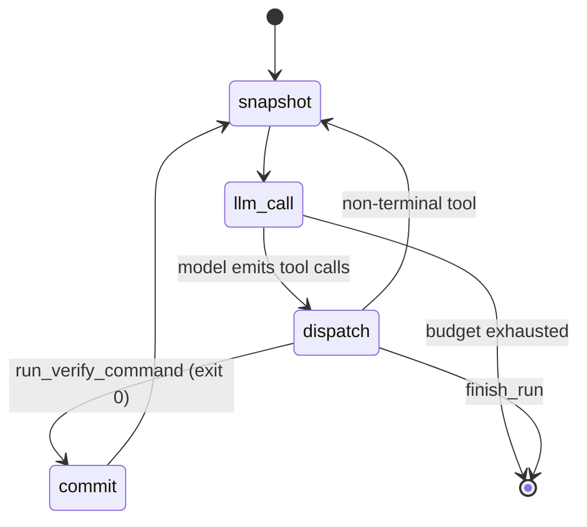
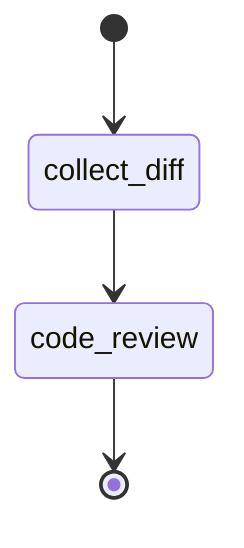
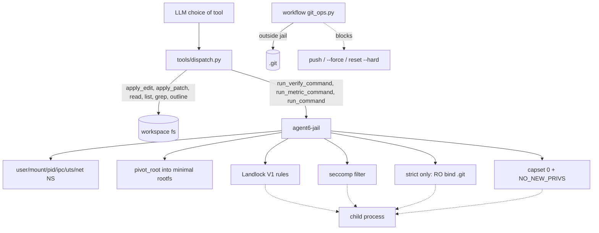
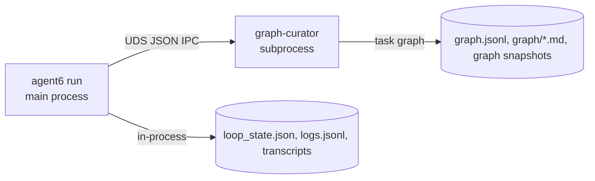

# Architecture

This document is a map of how agent6 runs end-to-end. The diagrams
are mermaid (`mermaid` fenced blocks render natively on GitHub). For
per-file conventions and stability rules see [AGENTS.md](https://github.com/agent6-dev/agent6/blob/master/AGENTS.md).
For the security model (threat model, defense layers, sandbox profiles),
see [security.md](security.md).

## Layering

```
cli  ──▶  workflows  ──▶  agents  ──▶  tools  ──▶  sandbox
                              │
                              └─▶ providers (anthropic | openai)
```

Boundaries are enforced by [tach](https://docs.gauge.sh/) (see
[tach.toml](https://github.com/agent6-dev/agent6/blob/master/tach.toml)). Workflows never import each other; agents never
import workflows or the CLI. Crossing a boundary is almost always a
sign of the wrong design.

- **cli** ([src/agent6/cli/](https://github.com/agent6-dev/agent6/tree/master/src/agent6/cli)): argument parsing,
  optional TUI spawn, top-level dispatch. Picks a workflow. Config is
  resolved by [config_layer.py](https://github.com/agent6-dev/agent6/blob/master/src/agent6/config_layer.py) (built-in
  secure defaults < global `~/.config/agent6/config.toml` < per-repo
  config < `--config FILE`), with paths + sudo/root
  resolution in [paths.py](https://github.com/agent6-dev/agent6/blob/master/src/agent6/paths.py) and API keys in
  [secrets.py](https://github.com/agent6-dev/agent6/blob/master/src/agent6/secrets.py). Per-repo state (config and run
  state together) lives out of the workspace under
  `$XDG_STATE_HOME/agent6/<repo-id>/`; the base is settable via the
  global-only `[agent6].state_dir` or the `AGENT6_STATE_HOME` env var.
  Roles: `worker` drives
  `run`/`resume`, `planner` drives `plan` (falls back to `worker`),
  `reviewer` drives `review` + the in-loop critic.
- **workflows** ([src/agent6/workflows/](https://github.com/agent6-dev/agent6/tree/master/src/agent6/workflows)): two
  exist, `loop` (the agent loop driving `agent6 run` / `agent6 resume`)
  and `review` (the read-only review pass driving `agent6 review`).
- **agents** ([src/agent6/agents/](https://github.com/agent6-dev/agent6/tree/master/src/agent6/agents)): single-turn
  LLM call shapes. The only one is `code_review`; the agent loop makes
  its own provider calls inline.
- **tools** ([src/agent6/tools/](https://github.com/agent6-dev/agent6/tree/master/src/agent6/tools)): the fixed
  tool surface the LLM sees, plus dispatch.
- **sandbox** ([src/agent6/sandbox/](https://github.com/agent6-dev/agent6/tree/master/src/agent6/sandbox)): Landlock
  on the agent process, `agent6-jail` for children.

## Workflow: `run`

This is the agent. One provider, one model, one message history. The
model drives by calling tools; the workflow dispatches tools, snapshots
state, and tracks budget.



Notes:

- **One LLM, one history, one loop.** No planner→worker handoff, no
  critic step, no separate reviewer agent. Multi-step work is the
  model calling the next tool in the same conversation.
- **Snapshot before every LLM call.** A `snapshots/<step>.json` is
  written to the run directory (`<state-dir>/<repo-id>/runs/<run-id>/`,
  out of the workspace) before each provider request.
  `agent6 resume <run-id>` rehydrates from the latest snapshot;
  combined with the per-tool transcripts under `transcripts/`, any
  interrupted run can be replayed deterministically up to the model
  call that comes next.
- **Per-step commits** fire when `run_verify_command` returns 0, via
  `git_ops.py` from outside the jail, onto the run branch (or your current
  branch when `branch_per_run` is off). Every passing step commits, so a run
  stays resumable and forkable; how those commits consolidate onto your branch
  is chosen later at `agent6 runs merge` time via `git.merge_strategy`
  (`squash` / `merge` / `ff`).
- **DAG-as-scaffold.** `add_task` / `update_task` /
  `set_cursor` / `list_tasks` write to a curator-owned side
  store: the worker's task breakdown. They do not pick which tool runs
  next, but agent6 reads the DAG to keep a small or weak model focused on
  a long task. Each turn it surfaces the current task -- the cursor when it
  still points at an open subtask, else the first dependency-satisfied
  pending subtask -- into the prompt, advances the cursor as tasks pass,
  and marks the surfaced task `in_progress`. It also refuses `finish_run`
  while the worker's own subtasks are still open (capped, so a task it
  cannot close cannot stall the run forever). The surfaced banner survives
  tier-1 elision and is re-injected after each tier-2 restart, so the
  worker always sees its current task without it being re-appended every
  turn. If the focus task holds for many turns with no forward motion
  (a weak model grinding one task without concluding or decomposing it), a
  nudge offers to split / pass / skip it -- re-firing periodically up to a
  small cap (a weak model was seen ignoring a single nudge); any progress
  resets the counter, so a healthy run never sees it.
- **Context compaction.** Long runs are kept inside the model's context
  window in two tiers (thresholds in `[context]`): at
  `drop_at_chars` the oldest tool_results are replaced by a
  short "re-call if needed" placeholder; at `summarise_at_chars`
  the elided history is summarised by the `reviewer` model and the
  conversation restarts from (task + summary). The curator-owned task
  DAG survives the restart: agent6 re-surfaces the current task into the
  fresh context (above), so the worker resumes the right task instead of
  starting over. At that tier-2 restart agent6 also asks the summariser
  which tracked tasks the transcript shows finished and what new work it
  found, then marks the finished ones `passed` and queues the new ones in
  the DAG -- so task state stays accurate even though weak models rarely
  call `update_task` themselves.
- **`finish_run(summary)`** is the only terminal tool. Calling it
  emits a `run.end` event and returns control to the CLI.

## Workflow: `review`

A single read-only pass ([src/agent6/workflows/review.py](https://github.com/agent6-dev/agent6/blob/master/src/agent6/workflows/review.py))
over a diff (working tree, branch-vs-base, or arbitrary range) using
the `agents/code_review.py` agent. Produces structured findings; no
edits, no commits, no `run_command`.



## Enforcement layering

[security.md](security.md) details which guarantee each layer provides.
As a diagram:



- `git_ops.py` runs outside the jail (the agent's own process), so
  the RO bind of `.git` does not stop the workflow from committing. It
  stops the worker.
- `protect_git` is strict-only. On strict the jail read-only
  bind-remounts `.git` on top of the workspace mount. The hardened
  profile (no mount namespace to carve with) grants blanket read-write
  on the repo cwd, so `.git` is writable by jailed commands there.
  Carving `.git` read-only on hardened would also deny new top-level
  entries and break toolchains like cargo/pytest that create `target/`
  or `.pytest_cache/`. The writable `.git` on hardened is acceptable:
  it is gated by `run_commands` (default `ask`), recoverable
  (branch-per-run, commits go through `git_ops`), and the surrounding
  container is the blast radius.
- Run state is safe from jailed commands because it lives out of the
  workspace (`<state-dir>/<repo-id>/`), unreachable from the repo cwd
  that jailed commands run on.

## Curator subprocess

The task graph is owned by a separate `graph-curator` subprocess
(`python -m agent6.graph.server`). The
main agent process writes the rest of the run state (resume snapshot,
event log, transcripts) in-process.



The agent talks to the curator over a Unix domain socket. The curator
validates every IPC frame against a pydantic schema before applying it,
so the on-disk graph stays consistent. What keeps the whole run
directory safe from jailed commands is its location: it lives out of the
workspace (`<state-dir>/<repo-id>/`), unreachable from the repo cwd that
jailed commands run on.

## Run state on disk

Each run's directory `<state-dir>/<repo-id>/runs/<run-id>/` holds:

- `graph.jsonl`: append-only journal of every task-graph mutation
  (curator-owned).
- `graph/*.md`: one markdown file per task node, rewritten atomically
  (curator-owned).
- `logs.jsonl`: the structured event stream (below), written by the
  main process.
- `loop_state.json`: the latest resume snapshot that drives `agent6 resume`,
  written by the main process before each LLM call and at iteration end.
- `checkpoints/<NNNN>.json`: append-only per-turn snapshots (NNNN =
  zero-padded `next_iteration`), each the same payload as `loop_state.json`
  plus the workspace `head_sha` and curator `graph_version` at that turn.
  `agent6 fork --at-turn N` rolls a run back to turn N by cloning the matching
  checkpoint into a new run. Kept in full (a run is dozens of turns); written
  by the main process alongside `loop_state.json`.
- `transcripts/`: full provider request/response pairs for replay,
  written by the main process.

A fork (`agent6 fork <src>`) clones a source run's state, as of a checkpoint,
into a NEW run dir with a new id: it copies the checkpoint as the new run's
`loop_state.json` + seed `checkpoints/0000.json`, copies the curator DAG
(`graph/`, `graph.jsonl`, `cursor.json`) verbatim, writes a manifest with
`parent_run_id` / `forked_from_turn` / `forked_from_sha`, and cuts
`agent6/<new>` at the turn's sha (additive `git branch`, the operator's
checkout is untouched). The source run is never mutated. One fork edge per line
lands in a per-repo `lineage.jsonl` at the state-dir root. Past-turn DAG replay
(reconstructing the graph at an older `graph_version`) is deferred; a fork copies
the source's current DAG.

One headless core, three thin front-ends: the CLI, the Textual TUI
([src/agent6/tui/](https://github.com/agent6-dev/agent6/tree/master/src/agent6/tui)),
and the browser web UI
([src/agent6/web/](https://github.com/agent6-dev/agent6/tree/master/src/agent6/web),
`agent6 web`) all fold the same event stream and render their own way. Two shared
layers sit under all three: the read side
[src/agent6/viewmodel/](https://github.com/agent6-dev/agent6/tree/master/src/agent6/viewmodel)
(the `RunState`/`MachineState` fold + its `*_as_dict` wire form, exactly what
`agent6 watch --json` and the web JSON/SSE endpoints emit) and the textual-free
write bridge
[src/agent6/frontend/](https://github.com/agent6-dev/agent6/tree/master/src/agent6/frontend)
(spawn the CLI detached, plus the approval / question / steer answer-file contract
the workflow process polls). See [the web UI](web.md).

The `logs.jsonl` vocabulary is small and stable: the data contract for
any external viewer (the fold to render-ready state lives in
[src/agent6/viewmodel/state.py](https://github.com/agent6-dev/agent6/blob/master/src/agent6/viewmodel/state.py) as a pure function, shared by the CLI, the TUI, and the web client):

| Event                       | Notable fields                              |
| --------------------------- | ------------------------------------------- |
| `run.start`                 | `user_task`                                 |
| `tool.call` / `.result`     | `name`, `args` (preview), `ok`, `summary`; emitted as a pair for every dispatched tool, including ones a guard rejects (`ok=false`, trusted reason), so no call is unaccounted for. Execution tools (`run_command`/`run_metric_command`) also carry capped `stdout_tail`/`stderr_tail` like `verify.end` |
| `verify.start` / `.end`     | `cmd`, `exit_code`, `duration_s`, `*_tail`  |
| `loop.verify_inferred`      | `command` (argv, `[]` if none), `source` (`agents_md`/manifest/`llm`/`none`) |
| `role.call` / `.result`     | `role`, `model`, `tokens_in`, `tokens_out`  |
| `role.text_delta`           | streamed assistant text chunk               |
| `role.thinking_delta`       | streamed reasoning chunk (TUI "thinking" pane) |
| `run.steer_requested`       | `source` (`"sigint"`): mid-run Ctrl-C       |
| `budget.update`             | totals + caps for input/output tokens       |
| `approval.prompt`/`.answer` | `id`, `prompt`, `approved`, `source` (`tui`/`stdin`) |
| `loop.*`                    | agent progress: `loop.auto_commit`, `loop.compact.*`, `loop.critic.*`, `loop.metric.*`, `loop.steer.*` |
| `loop.budget`               | per-iteration usage heartbeat: `iteration`, `input_tokens`, `output_tokens`, `cache_read_tokens`, `cost_usd` (read by `agent6 runs show`) |
| `loop.review.*`             | adversarial review panel: `loop.review.start` (trigger, seats), `loop.review.seat` (seat, model, verdict, findings), `loop.review.panel` (blocked, raw_blocked, decision, n_block, disarmed), `loop.review.skipped` |
| `run.end`                   | `summary`                                   |

A `run_command` approval is published as `approval.prompt`; the dashboard
TUI shows an Allow/Deny modal and writes `approvals/<id>.answer`, which the
workflow reads (falling back to a stdin prompt with no TUI), then records
`approval.answer`. The web UI drives the same answer-file contract (via
[src/agent6/frontend/](https://github.com/agent6-dev/agent6/tree/master/src/agent6/frontend)):
while a browser watches a run it registers as the run's answer front-end, so
approval / question / steer prompts bridge to the page. The task DAG is not in this stream; it is
curator-owned and lives in `graph.jsonl` (read via `agent6 runs
graph`).

## Where things live

| Concern                          | File / dir                                                            |
| -------------------------------- | --------------------------------------------------------------------- |
| Config schema                    | [src/agent6/config.py](https://github.com/agent6-dev/agent6/blob/master/src/agent6/config.py)                          |
| Tool surface                     | [src/agent6/tools/schema.py](https://github.com/agent6-dev/agent6/blob/master/src/agent6/tools/schema.py)              |
| Tool dispatch                    | [src/agent6/tools/dispatch.py](https://github.com/agent6-dev/agent6/blob/master/src/agent6/tools/dispatch.py)          |
| agent loop                       | [src/agent6/workflows/loop.py](https://github.com/agent6-dev/agent6/blob/master/src/agent6/workflows/loop.py)          |
| Review workflow                  | [src/agent6/workflows/review.py](https://github.com/agent6-dev/agent6/blob/master/src/agent6/workflows/review.py)      |
| Code-review agent                | [src/agent6/agents/code_review.py](https://github.com/agent6-dev/agent6/blob/master/src/agent6/agents/code_review.py)  |
| Jail launcher (Python wrapper)   | [src/agent6/sandbox/jail.py](https://github.com/agent6-dev/agent6/blob/master/src/agent6/sandbox/jail.py)              |
| Jail launcher (Rust binary)      | [src/agent6/jail/src/main.rs](https://github.com/agent6-dev/agent6/blob/master/src/agent6/jail/src/main.rs)            |
| Git policy                       | [src/agent6/git_ops.py](https://github.com/agent6-dev/agent6/blob/master/src/agent6/git_ops.py)                        |
| Provider clients                 | [src/agent6/providers/](https://github.com/agent6-dev/agent6/tree/master/src/agent6/providers)                        |
| Knowledge graph (curator)        | [src/agent6/graph/](https://github.com/agent6-dev/agent6/tree/master/src/agent6/graph)                                |
| Event log + view-model fold      | [src/agent6/events.py](https://github.com/agent6-dev/agent6/blob/master/src/agent6/events.py) (writer), [src/agent6/viewmodel/](https://github.com/agent6-dev/agent6/tree/master/src/agent6/viewmodel) (RunState/MachineState fold), [src/agent6/tui/](https://github.com/agent6-dev/agent6/tree/master/src/agent6/tui) (textual render) |
| Front-end write bridge           | [src/agent6/frontend/](https://github.com/agent6-dev/agent6/tree/master/src/agent6/frontend) (spawn detached + approval/question/steer answer files; shared by CLI, TUI, web) |
| Web UI (`agent6 web`)            | [src/agent6/web/](https://github.com/agent6-dev/agent6/tree/master/src/agent6/web) (stdlib HTTP server + one embedded page over the view-model + frontend) |
| Run state on disk                | `<state-dir>/<repo-id>/runs/<run-id>/` (out of the workspace)         |

## Pre-1.0 stability

See [AGENTS.md](https://github.com/agent6-dev/agent6/blob/master/AGENTS.md). Until 1.0 every public shape (config TOML,
IPC frames, on-disk graph, CLI flags, transcript layout) is liquid;
we break cleanly rather than carry shims.
