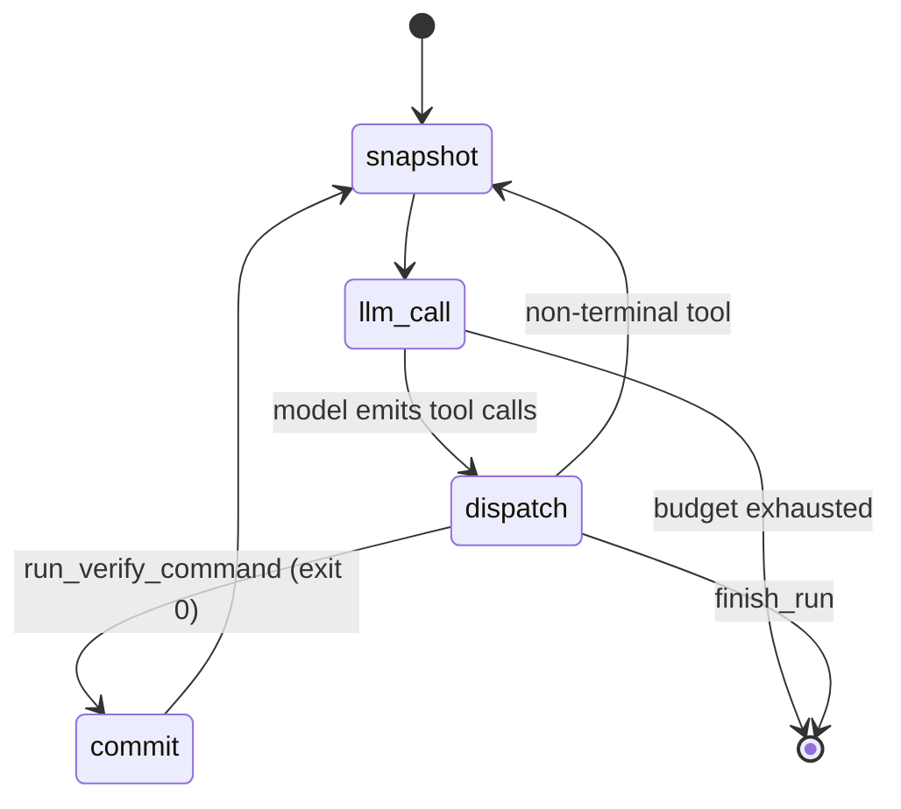
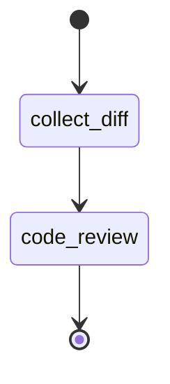
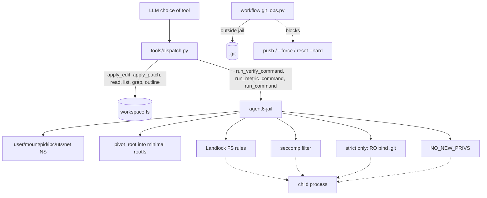
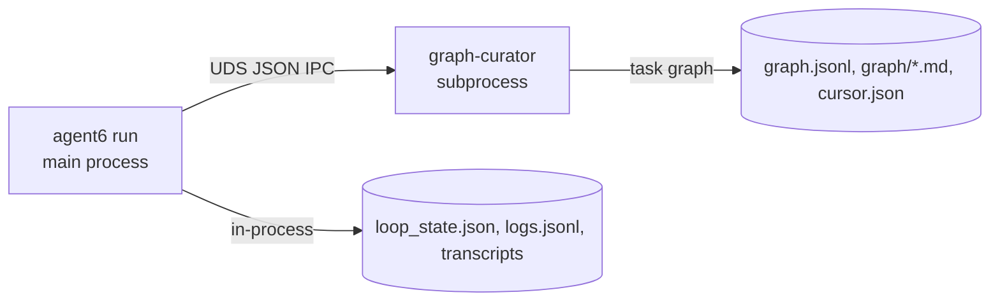

# Architecture

This document is a map of how agent6 runs end-to-end. The diagrams
are mermaid (`mermaid` fenced blocks render natively on GitHub). For
per-file conventions and stability rules see [AGENTS.md](https://github.com/agent6-dev/agent6/blob/master/AGENTS.md).
For the security model (threat model, defense layers, sandbox profiles),
see [security.md](security.md).

## Layering

```
ui  ──▶  workflows  ──▶  agents  ──▶  tools  ──▶  sandbox
                             │
                             └─▶ providers (anthropic | openai)
```

`ui/` is the presentation layer and composition root: `ui/cli`, `ui/tui`,
`ui/web` (the three front-ends) and `ui/bridge` (spawn / approval / notify),
over the shared headless read-model fold (`viewmodel`). Boundaries are enforced by
[tach](https://docs.gauge.sh/) (see
[tach.toml](https://github.com/agent6-dev/agent6/blob/master/tach.toml)). Workflows never import each other; the engine
(workflows and everything below) never imports the UI. Crossing a boundary is
almost always a sign of the wrong design.

- **cli** ([src/agent6/ui/cli/](https://github.com/agent6-dev/agent6/tree/master/src/agent6/ui/cli)): argument parsing,
  optional TUI spawn, top-level dispatch. Picks a workflow. Config is
  resolved by [config/layer.py](https://github.com/agent6-dev/agent6/blob/master/src/agent6/config/layer.py) (built-in
  secure defaults < global `~/.config/agent6/config.toml` < per-repo
  config < `--config FILE`), with paths + sudo/root
  resolution in [paths.py](https://github.com/agent6-dev/agent6/blob/master/src/agent6/paths.py) and API keys in
  [secrets.py](https://github.com/agent6-dev/agent6/blob/master/src/agent6/secrets.py). Per-repo state (config and run
  state together) lives out of the workspace under
  `$XDG_STATE_HOME/agent6/<repo-id>/`; the base is settable via the
  global-only `[agent6].state_dir` or the `AGENT6_STATE_HOME` env var.
  Roles: `worker` drives
  `run`/`resume`, `planner` drives `plan` (falls back to `worker`),
  `reviewer` drives `review` + the in-loop critic.
- **workflows** ([src/agent6/workflows/](https://github.com/agent6-dev/agent6/tree/master/src/agent6/workflows)): two
  exist, `loop` (the agent loop driving `agent6 run` / `agent6 resume`)
  and `review` (the read-only review pass driving `agent6 review`).
- **agents** ([src/agent6/agents/](https://github.com/agent6-dev/agent6/tree/master/src/agent6/agents)): single-turn
  LLM call shapes. The only one is `code_review`; the agent loop makes
  its own provider calls inline.
- **tools** ([src/agent6/tools/](https://github.com/agent6-dev/agent6/tree/master/src/agent6/tools)): the fixed
  tool surface the LLM sees, plus dispatch.
- **sandbox** ([src/agent6/sandbox/](https://github.com/agent6-dev/agent6/tree/master/src/agent6/sandbox)): Landlock
  on the agent process, `agent6-jail` for children.

## Workflow: `run`

This is the agent. One provider, one model, one message history. The
model drives by calling tools; the workflow dispatches tools, snapshots
state, and tracks budget.



Notes:

- **One LLM, one history, one loop.** By default there is no
  planner→worker handoff, no critic step, no separate reviewer agent:
  multi-step work is the model calling the next tool in the same
  conversation. The in-loop critic and the adversarial review panel
  are opt-in (`[review]` config) and layer onto this same history.
- **Snapshot before every LLM call.** `loop_state.json` is rewritten
  in the run directory (`<state-dir>/<repo-id>/runs/<run-id>/`,
  out of the workspace) before each provider request, with a per-turn
  copy under `checkpoints/<NNNN>.json` (see "Run state on disk").
  `agent6 resume <run-id>` rehydrates from `loop_state.json`,
  `agent6 fork --at-turn N` from the matching checkpoint;
  combined with the per-tool transcripts under `transcripts/`, any
  interrupted run can be replayed deterministically up to the model
  call that comes next.
- **Per-step commits** fire when `run_verify_command` returns 0, via
  `git_ops.py` from outside the jail, onto the run branch (or your current
  branch when `branch_per_run` is off). Every passing step commits, so a run
  stays resumable and forkable; how those commits consolidate onto your branch
  is chosen later at `agent6 runs merge` time via `git.merge_strategy`
  (`squash` / `merge` / `ff`).
- **DAG-as-scaffold.** `add_task` / `update_task` /
  `set_cursor` / `list_tasks` / `add_dependency` write to a curator-owned
  side store: the worker's task breakdown, with explicit ordering edges
  (`add_dependency` is cycle-checked by the curator). They do not pick
  which tool runs
  next, but agent6 reads the DAG to keep a small or weak model focused on
  a long task. Each turn it surfaces the current task -- the cursor when it
  still points at an open subtask, else the first dependency-satisfied
  pending subtask -- into the prompt, advances the cursor as tasks pass,
  and marks the surfaced task `in_progress`. It also refuses `finish_run`
  while the worker's own subtasks are still open (capped, so a task it
  cannot close cannot stall the run forever). The surfaced banner survives
  tier-1 elision and is re-injected after each tier-2 restart, so the
  worker always sees its current task without it being re-appended every
  turn. If the focus task holds for many turns with no forward motion
  (a weak model grinding one task without concluding or decomposing it), a
  nudge offers to split / pass / skip it -- re-firing periodically up to a
  small cap (a weak model was seen ignoring a single nudge); any progress
  resets the counter, so a healthy run never sees it.
- **Context compaction.** Long runs are kept inside the model's context
  window in two tiers (thresholds in `[context]`): at
  `drop_at_chars` the oldest tool_results are replaced by a short
  placeholder naming the elided call (`read_file src/x.py ...`), with
  reads of files the worker edited in the last few turns elided last
  (a placeholder there would force a paid re-read before the next
  edit; it is a priority, not an exemption, so the bound holds). A
  large `read_file` result decays in two stages: first to a placeholder
  carrying a distilled gist of the file's load-bearing facts (one
  batched reviewer-model call per drop event; measured on the
  longhorizon bench, bare elision of reference docs halves a retention
  task's score under a small window), then under continued pressure to
  the bare marker, oldest gists first, so the byte bound always holds.
  Hot files are never gisted (their content is changing under edits).
  At `summarise_at_chars`
  the elided history is summarised by the `reviewer` model and the
  conversation restarts from (task + summary). The curator-owned task
  DAG survives the restart: agent6 re-surfaces the current task into the
  fresh context (above), so the worker resumes the right task instead of
  starting over. At that tier-2 restart agent6 also asks the summariser
  which tracked tasks the transcript shows finished and what new work it
  found, then marks the finished ones `passed` and queues the new ones in
  the DAG -- so task state stays accurate even though weak models rarely
  call `update_task` themselves.
- **Cross-run memory.** At run start the loop loads the active entries
  from the per-repo memory store (`<state-dir>/<repo-id>/memories/`,
  written by `agent6 memory add` or a previous run) and injects them as a
  size-capped `<memories>` block after the repo priors; newest entries win
  when the cap trims. The worker persists new knowledge with `add_memory`
  and retires stale entries with `invalidate_memory` (non-destructive; the
  body stays on disk for `agent6 memory list --all`). Run mode only: plan
  and ask read memories but cannot write them, machine modes see neither.
  A resumed run keeps the `<memories>` block frozen in its snapshot, like
  the rest of its system prompt. Because models never call `add_memory`
  unprompted (measured: 46 bench legs, zero calls), the loop surfaces it
  twice: an advisory when verify first goes green after a red one, and a
  once-deferred `finish_run` after such a recovery if nothing was
  recorded. Each fires at most once per run and never on a run whose
  verify never failed.
- **Skills.** At run start the loop resolves operator-installed SKILL.md
  packs (`<data-dir>/skills/`, plus `[skills].extra_dirs`) through the
  dispatcher's single resolution, so the `<skills>` system-prompt index and
  what `use_skill` serves can never diverge. `always`-state skills inject
  their full text; the rest get one index line each and load on demand.
  Run mode only. Delivery is measured, not assumed: small models never call
  `use_skill` from the index alone, so the reliable paths are `always`,
  `/name` in the pause menu, and `run --skill` (see docs/config.md).
- **`finish_run(summary)`** is the only terminal tool. Calling it
  emits a `run.end` event and returns control to the CLI.

## Workflow: `review`

A single read-only pass ([src/agent6/workflows/review.py](https://github.com/agent6-dev/agent6/blob/master/src/agent6/workflows/review.py))
over a diff (working tree, branch-vs-base, or arbitrary range) using
the `agents/code_review.py` agent. Produces structured findings; no
edits, no commits, no `run_command`.



## Parallel runs: fan-out and coordinator dispatch

Three consumers drive one primitive (a task run as a subordinate isolated run
whose branch joins back): `run --parallel`, the web/TUI composer's `/parallel`
new-work directive (it spawns `run --parallel`), and a live run's `/parallel`
steer. All three share ONE grammar,
[src/agent6/directive.py](https://github.com/agent6-dev/agent6/blob/master/src/agent6/directive.py)
(a pure-stdlib leaf both `workflows` and `ui` import):
`/parallel [spec] <task> [/parallel [spec] <task>]...`, where `spec` is an
optional lane count or model list (omitted = one lane) and `parse_spec` maps a
spec to one model per lane -- the same value grammar as `run --parallel <spec>`.
A segment's first token counts as a spec when it contains a comma or a slash
(model ids are provider/model shaped); a bare comma-less slash-less name
(`opus`) stays task text, and a task whose first word is a path (`src/foo.py`)
parses as a bogus model spec -- start the task with a verb. Before any clone, a
spec's models are checked against the models a lane can actually run: lanes
inherit the WORKER provider (only the model is overridden per lane), so the
universe is the worker's configured model plus the worker provider's cached
listing, in one helper,
[src/agent6/models/validate.py](https://github.com/agent6-dev/agent6/blob/master/src/agent6/models/validate.py):
an unknown model refuses early with a did-you-mean when the worker provider has
a cache to check against, or proceeds with a warning when none does (a
fresh/offline machine is never blocked on a regenerable cache). All three consumers validate through this
one helper -- the `run --parallel` CLI preflight, the composer submit paths, and
the coordinator's ui-built group dispatcher (so `workflows` needs no models
dependency; a refused dispatch raises and the loop's group-failure feedback
carries the message). `runs compare` is not one of them; it only reads
already-finished runs to rank them, never cloning, importing, or joining. The
primitive is pure git plumbing in
[src/agent6/workflows/subrun.py](https://github.com/agent6-dev/agent6/blob/master/src/agent6/workflows/subrun.py)
(no LLM, no UI, no process spawning), over `git_ops`:

- `clone_workspace(origin, dest)`: plain `git clone` of a disposable lane workspace.
- `import_run(origin, lane_repo, branch, lane_run_dir, origin_state)`: fetches the
  lane's branch into *origin* and moves its run dir under `<origin_state>/runs/`;
  refuses to overwrite an existing branch or run dir.
- `join_branch(workspace, branch)`: merges a branch into the current branch;
  returns the merged sha, or `None` after an aborted conflict.
- `LaneSpawner` / `GroupLaneSpawner` Protocols: one lane, or a sibling group,
  dispatched and awaited to completion.

`ui/cli/parallel.py` is the composition-root orchestrator: it implements the
spawner Protocols over the existing front-end bridge (`ui.bridge.spawn`, the
same detached-spawn path `attach`/`resume` use) and is the only module that
knows how to actually run a lane.

- **`agent6 run --parallel N|model-a,model-b`** (`dispatch_parallel` /
  `run_parallel`): plans one `LaneSpec` per lane, spawns each as an ordinary
  detached `agent6 run` (its own jail, egress broker, `run_commands` policy --
  see [security.md](security.md)), symlinks each lane's live run dir into
  `<origin_state>/runs/` as soon as it is located, and polls until every lane
  is terminal. Every hub (`agent6 runs`, the TUI, the web hub) resolves that
  symlink like any other run dir, so a fan-out is visible live, not just at
  the end. On completion each lane is imported (`import_run`) and the symlink
  is replaced by the real directory; an un-imported lane (failed to start,
  still running, import refused) keeps its clone and symlink rather than
  losing the only copy of its work. Imported candidates are auto-compared
  (`workflows/judge.py`'s structured judge call when a reviewer model is
  configured, else a mechanical verify-then-cost ranking) into a ranked
  report with `agent6 runs merge <id>` lines. The auto-compare also stamps a
  `compare` block (`group`/`rank`/`of`/`winner`/`ranked_by`/`rationale`) into
  each imported lane's manifest -- the ONE writer (`runs compare` stays
  stateless, the coordinator never compares its lanes) -- so every run view
  (`runs show`, TUI/web run headers) shows where a lane placed and why, and the
  listings mark the winner with a `★`. Nothing merges automatically.
  `--max-usd` is per lane (total spend up to `--max-usd` x lane count; the
  orchestrator prints the `$X/lane x N = $Y total` line before spawning). The
  web hub and TUI home new-run composers spawn the same fan-out from a
  `/parallel [spec] <task>` directive (parsed by `agent6.directive`); a
  multi-segment message spawns one detached `run --parallel <spec>` per segment
  (omitted spec = `--parallel 1`, one isolated lane). A malformed directive is
  refused before any spawn (all-or-nothing).
- **`agent6 runs compare <id> <id> ...`** (`ui/cli/_compare.py`, shared by both
  callers so the ranking/report logic exists once): the same ranked report
  over any >=2 existing runs, including different-task runs; degrades to the
  mechanical table without a reviewer model.
- **Coordinator dispatch**: `Workflow.lane_spawner: GroupLaneSpawner | None`
  on the agent loop ([workflows/loop.py](https://github.com/agent6-dev/agent6/blob/master/src/agent6/workflows/loop.py))
  is the injection point that keeps `workflows` from importing `ui` (the
  Protocol lives in `subrun.py`, workflows never imports `ui/cli/parallel.py`
  directly; `tach` enforces it). `run.py`/`resume.py` build the real spawner
  (`build_coordinator_spawner`) and wire it in for a `run`-mode workflow only.
  A steer message starting with the exact `/parallel` token (Ctrl-C pause menu,
  or any steer surface) dispatches a sibling group: the loop blocks (no provider
  calls while lanes run), commits a dirty worktree first (lanes clone committed
  HEAD only), expands each segment into its lanes (`spec` -> one model per lane),
  then clones + spawns + awaits + imports every lane and joins each branch into
  the run branch sequentially in dispatch order (`join_branch`). Like the
  fan-out, each lane's run dir is symlinked into `<origin_state>/runs/` while it
  runs, so coordinator lanes appear in the hubs like fan-out lanes and their
  approvals/asks are answered there. Each SEGMENT (task) gets one DAG node
  stamped `passed` (with the last joined sha; its note names every lane) or
  `failed` (all lanes failed or conflicted); a conflict aborts that one merge
  and tells the model to resolve it manually, and the run continues either way.
  Events `loop.parallel.dispatched`/`joined`/`failed` record the fan-out; the
  shared transcript fold (`viewmodel/transcript.py`) renders them as
  conversation markers on every surface (dispatched: the task count + tasks,
  truthfully -- lane ids do not exist yet; joined: each lane's id/branch/sha/
  status; a dispatch failure: the error), so the coordinator's blocked wait is
  visible rather than silent. The injected `[parallel]` summary message is what
  carries the user-facing outcome to the model and continues the conversation.

**Depth 1.** Every spawned lane carries `AGENT6_SUBRUN=1`; both `--parallel`
and `build_coordinator_spawner` refuse to wire a `lane_spawner` when it is
set, so a lane's own run can never itself fan out or dispatch.

## Enforcement layering

[security.md](security.md) details which guarantee each layer provides.
As a diagram:



- `git_ops.py` runs outside the jail (the agent's own process), so
  the RO bind of `.git` does not stop the workflow from committing. It
  stops the worker.
- `protect_git` is strict-only. On strict the jail read-only
  bind-remounts `.git` on top of the workspace mount. The hardened
  profile (no mount namespace to carve with) grants blanket read-write
  on the repo cwd, so `.git` is writable by jailed commands there.
  Carving `.git` read-only on hardened would also deny new top-level
  entries and break toolchains like cargo/pytest that create `target/`
  or `.pytest_cache/`. The writable `.git` on hardened is acceptable:
  it is gated by `run_commands` (default `ask`), recoverable
  (branch-per-run, commits go through `git_ops`), and the surrounding
  container is the blast radius.
- Run state is safe from jailed commands because it lives out of the
  workspace (`<state-dir>/<repo-id>/`), unreachable from the repo cwd
  that jailed commands run on.

## Curator subprocess

The task graph is owned by a separate `graph-curator` subprocess
(`python -m agent6.graph.server`). The
main agent process writes the rest of the run state (resume snapshot,
event log, transcripts) in-process.



The agent talks to the curator over a Unix domain socket. The curator
validates every IPC frame against a pydantic schema before applying it,
so the on-disk graph stays consistent. What keeps the whole run
directory safe from jailed commands is its location: it lives out of the
workspace (`<state-dir>/<repo-id>/`), unreachable from the repo cwd that
jailed commands run on.

One curator per run is an invariant: two live curators on one run dir cache the
graph independently, so a second one's write silently drops the first's
parent→child links. `agent6 run`/`resume`/`fork` therefore take a run-level
single-writer flock on `<run-dir>/worker.lock` (the analogue of `machine.lock`)
before spawning the curator; a second process on the same run refuses. A crashed
writer releases the lock on death, so resume-after-crash is never blocked.

## Run state on disk

Each run's directory `<state-dir>/<repo-id>/runs/<run-id>/` holds:

- `graph.jsonl`: append-only journal of every task-graph mutation
  (curator-owned).
- `graph/*.md`: one markdown file per task node, rewritten atomically
  (curator-owned).
- `logs.jsonl`: the structured event stream (below), written by the
  main process.
- `loop_state.json`: the latest resume snapshot that drives `agent6 resume`,
  written by the main process before each LLM call and at iteration end.
- `checkpoints/<NNNN>.json`: append-only per-turn snapshots (NNNN =
  zero-padded `next_iteration`), each a byte-identical copy of
  `loop_state.json` at that turn (the snapshot payload already carries the
  workspace `head_sha` and curator `graph_version`). `loop_state.json` is the
  latest-pointer for resume; `checkpoints/` is the per-turn history.
  `agent6 fork --at-turn N` rolls a run back to turn N by cloning the matching
  checkpoint into a new run. Kept in full (a run is dozens of turns); written
  by the main process alongside `loop_state.json`.
- `transcripts/`: full provider request/response pairs for replay,
  written by the main process.

A fork (`agent6 fork <src>`) clones a source run's state, as of a checkpoint,
into a NEW run dir with a new id: it copies the checkpoint as the new run's
`loop_state.json` + seed `checkpoints/0000.json`, copies the curator DAG
(`graph/`, `graph.jsonl`, `cursor.json`) verbatim, writes a manifest with
`parent_run_id` / `forked_from_turn` / `forked_from_sha`, and cuts
`agent6/<new>` at the turn's sha (additive `git branch`, the operator's
checkout is untouched). The source run is never mutated. One fork edge per line
lands in a per-repo `lineage.jsonl` at the state-dir root. Past-turn DAG replay
(reconstructing the graph at an older `graph_version`) is deferred; a fork copies
the source's current DAG.

The fork's tree is the repo as of that committed sha, nothing more. On a gated
run (commits fire only on a green verify) an edit not yet committed at the forked
turn is absent from the fork's tree even though the copied transcript mentions
it, the same "head_sha is committed history only" posture `resume` documents
(resume differs only in continuing on the live working tree). The forked run
picks it back up by re-reading the real on-disk files. Modelling a fork as a
commit plus the conversation up to that turn is the design choice: predictable
and cheap, versus snapshotting uncommitted bytes into every checkpoint.

One headless core, three thin front-ends: the CLI, the Textual TUI
([src/agent6/ui/tui/](https://github.com/agent6-dev/agent6/tree/master/src/agent6/ui/tui)),
and the browser web UI
([src/agent6/ui/web/](https://github.com/agent6-dev/agent6/tree/master/src/agent6/ui/web),
`agent6 web`) all fold the same event stream and render their own way. Two shared
layers sit under all three: the read side
[src/agent6/viewmodel/](https://github.com/agent6-dev/agent6/tree/master/src/agent6/viewmodel)
(the `RunState`/`MachineState` fold + its `*_as_dict` wire form, exactly what
`agent6 attach --json` and the web JSON/SSE endpoints emit) and the textual-free
write bridge
[src/agent6/ui/bridge/](https://github.com/agent6-dev/agent6/tree/master/src/agent6/ui/bridge)
(spawn the CLI detached, plus the approval / question / steer / compact-request
file contract the workflow process polls). See [the web UI](web.md).

The `logs.jsonl` vocabulary is small and stable: the data contract for
any external viewer (the fold to render-ready state lives in
[src/agent6/viewmodel/state.py](https://github.com/agent6-dev/agent6/blob/master/src/agent6/viewmodel/state.py) as a pure function, shared by the CLI, the TUI, and the web client):

| Event                       | Notable fields                              |
| --------------------------- | ------------------------------------------- |
| `run.start`                 | `user_task`                                 |
| `tool.call` / `.result`     | `name`, `args` (preview), `ok`, `summary`; emitted as a pair for every dispatched tool, including ones a guard rejects (`ok=false`, trusted reason), so no call is unaccounted for. Execution tools (`run_command`/`run_metric_command`) also carry capped `stdout_tail`/`stderr_tail` like `verify.end` |
| `verify.start` / `.end`     | `cmd`, `exit_code`, `duration_s`, `*_tail`  |
| `loop.verify_inferred`      | `command` (argv, `[]` if none), `source` (`agents_md`/manifest/`llm`/`none`) |
| `role.call` / `.result`     | `role`, `model`, `tokens_in`, `tokens_out`  |
| `role.text_delta`           | streamed assistant text chunk               |
| `role.thinking_delta`       | streamed reasoning chunk (TUI "thinking" pane) |
| `run.steer_requested`       | `source` (`"sigint"`): mid-run Ctrl-C       |
| `budget.update`             | totals + caps for input/output tokens       |
| `approval.prompt`/`.answer` | `id`, `prompt`, `approved`, `source` (`tui`/`stdin`) |
| `question.prompt`/`.answer` | `id`, `question`, `options` / `id`, `answer`, `source`: the `ask_user` tool and machine questioner states |
| `loop.*`                    | agent progress: `loop.auto_commit`, `loop.compact.*`, `loop.critic.*`, `loop.metric.*`, `loop.steer.*` |
| `loop.budget`               | per-iteration usage heartbeat: `iteration`, `input_tokens`, `output_tokens`, `cache_read_tokens`, `cost_usd` (read by `agent6 runs show`) |
| `loop.review.*`             | adversarial review panel: `loop.review.start` (trigger, seats), `loop.review.seat` (seat, model, verdict, findings), `loop.review.panel` (blocked, raw_blocked, decision, n_block, disarmed), `loop.review.skipped` |
| `run.end`                   | `summary`                                   |

A `run_command` approval is published as `approval.prompt`; the dashboard
TUI shows an Allow/Deny modal and writes `approvals/<id>.answer`, which the
workflow reads, then records `approval.answer`. The answer poll falls back
headless (stdin prompt, or deny for a machine state) only after the front-end
has stayed dead for 30 consecutive seconds, so a transient drop (a page
reload, a phone locking its browser) does not convert a pending approval into
a deny. The web UI drives the same answer-file contract (via
[src/agent6/ui/bridge/](https://github.com/agent6-dev/agent6/tree/master/src/agent6/ui/bridge)):
while a browser watches a run it registers as the run's answer front-end, so
approval / question / steer prompts bridge to the page. The task DAG is not in this stream; it is
curator-owned and lives in `graph.jsonl` (read via `agent6 runs
graph`).

## Where things live

| Concern                          | File / dir                                                            |
| -------------------------------- | --------------------------------------------------------------------- |
| Config schema                    | [src/agent6/config/model.py](https://github.com/agent6-dev/agent6/blob/master/src/agent6/config/model.py)                          |
| Tool surface                     | [src/agent6/tools/schema.py](https://github.com/agent6-dev/agent6/blob/master/src/agent6/tools/schema.py)              |
| Tool dispatch                    | [src/agent6/tools/dispatch.py](https://github.com/agent6-dev/agent6/blob/master/src/agent6/tools/dispatch.py)          |
| agent loop                       | [src/agent6/workflows/loop.py](https://github.com/agent6-dev/agent6/blob/master/src/agent6/workflows/loop.py)          |
| Review workflow                  | [src/agent6/workflows/review.py](https://github.com/agent6-dev/agent6/blob/master/src/agent6/workflows/review.py)      |
| Code-review agent                | [src/agent6/agents/code_review.py](https://github.com/agent6-dev/agent6/blob/master/src/agent6/agents/code_review.py)  |
| Jail launcher (Python wrapper)   | [src/agent6/sandbox/jail.py](https://github.com/agent6-dev/agent6/blob/master/src/agent6/sandbox/jail.py)              |
| Jail launcher (Rust binary)      | [src/agent6/jail/src/main.rs](https://github.com/agent6-dev/agent6/blob/master/src/agent6/jail/src/main.rs)            |
| Git policy                       | [src/agent6/git_ops.py](https://github.com/agent6-dev/agent6/blob/master/src/agent6/git_ops.py)                        |
| Subordinate-run primitive (clone/import/join) | [src/agent6/workflows/subrun.py](https://github.com/agent6-dev/agent6/blob/master/src/agent6/workflows/subrun.py) |
| Compare judge (structured ranking) | [src/agent6/workflows/judge.py](https://github.com/agent6-dev/agent6/blob/master/src/agent6/workflows/judge.py) |
| Fan-out orchestrator (`run --parallel`, coordinator spawner) | [src/agent6/ui/cli/parallel.py](https://github.com/agent6-dev/agent6/blob/master/src/agent6/ui/cli/parallel.py) |
| Provider clients                 | [src/agent6/providers/](https://github.com/agent6-dev/agent6/tree/master/src/agent6/providers)                        |
| Knowledge graph (curator)        | [src/agent6/graph/](https://github.com/agent6-dev/agent6/tree/master/src/agent6/graph)                                |
| Event log + view-model fold      | [src/agent6/events.py](https://github.com/agent6-dev/agent6/blob/master/src/agent6/events.py) (writer), [src/agent6/viewmodel/](https://github.com/agent6-dev/agent6/tree/master/src/agent6/viewmodel) (RunState/MachineState fold), [src/agent6/ui/tui/](https://github.com/agent6-dev/agent6/tree/master/src/agent6/ui/tui) (textual render) |
| Front-end write bridge           | [src/agent6/ui/bridge/](https://github.com/agent6-dev/agent6/tree/master/src/agent6/ui/bridge) (spawn detached + approval/question/steer/compact bridge files; shared by CLI, TUI, web) |
| Web UI (`agent6 web`)            | [src/agent6/ui/web/](https://github.com/agent6-dev/agent6/tree/master/src/agent6/ui/web) (stdlib HTTP server + one embedded page over the view-model + frontend) |
| Cross-run memory store           | [src/agent6/memory.py](https://github.com/agent6-dev/agent6/blob/master/src/agent6/memory.py) (store), `<state-dir>/<repo-id>/memories/` (data) |
| Run state on disk                | `<state-dir>/<repo-id>/runs/<run-id>/` (out of the workspace)         |

## Pre-1.0 stability

See [AGENTS.md](https://github.com/agent6-dev/agent6/blob/master/AGENTS.md). Until 1.0 every public shape (config TOML,
IPC frames, on-disk graph, CLI flags, transcript layout) is liquid;
we break cleanly rather than carry shims.
