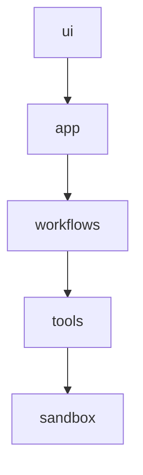
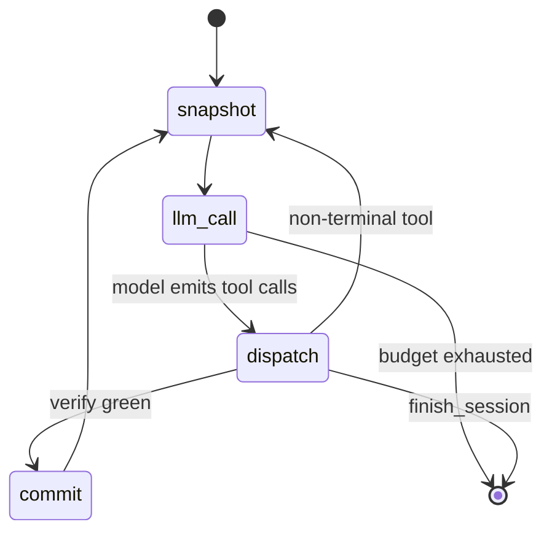
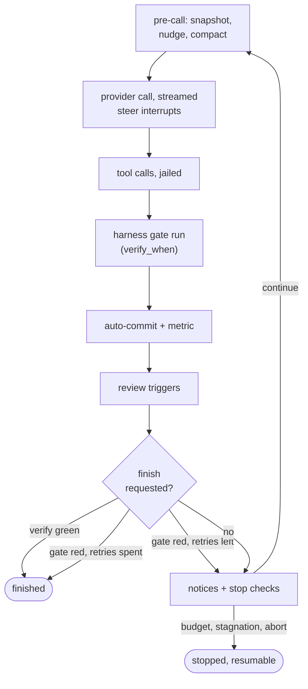
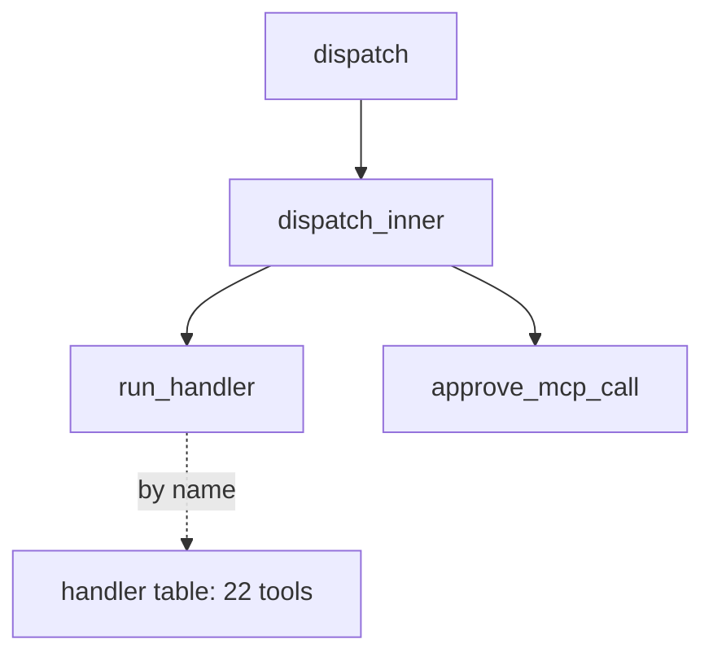
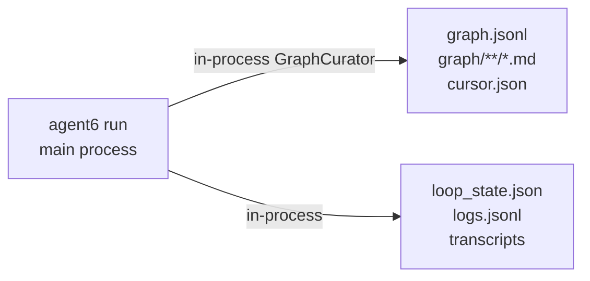

<!-- Generated from docs/architecture_template.md by docs/gen_diagrams.py; edit that, then regenerate. -->
# Architecture

How agent6 runs, end to end.
Three diagrams are built from the current source at site-build time (`docs/gen_diagrams.py`); the other three are drawn by hand, and each says so above its block.
[security.md](security.md) covers the threat model and what each isolation level enforces; [AGENTS.md](https://github.com/agent6-dev/agent6/blob/master/AGENTS.md) covers per-file conventions and stability rules.

## Layering

The engine stack is `ui -> app -> workflows -> tools -> sandbox`.
An edge is "imports from"; a dashed edge would mark an import climbing the stack.
[tach](https://docs.gauge.sh/) records the map ([tach.toml](https://github.com/agent6-dev/agent6/blob/master/tach.toml)); `loop` and `review` never import each other, and the engine never imports the UI.

```mermaid
graph TD
    n_ui["ui"]
    n_app["app"]
    n_workflows["workflows"]
    n_tools["tools"]
    n_sandbox["sandbox"]
    n_ui --> n_app
    n_app --> n_workflows
    n_workflows --> n_tools
    n_tools --> n_sandbox
```

Any layer may also use the shared substrate: `_data`, `budget`, `child_env`, `commit_message`, `config`, `directive`, `errors`, `events`, `git_ops`, `graph`, `init`, `machine`, `memory`, `models`, `paths`, `portable`, `prompts`, `providers`, `secrets`, `sessions`, `skills`, `task_text`, `types`, `verify_infer`, `viewmodel`.

- **ui** ([src/agent6/ui/](https://github.com/agent6-dev/agent6/tree/master/src/agent6/ui)): the presentation layer and composition root, over the shared read-model fold (`viewmodel`)
    - the four front-ends: `ui/cli`, `ui/tui`, `ui/web`, `ui/acp`
    - `ui/mcp_server.py`: agent6 as an MCP server
    - the write helpers: `ui/spawn`, `ui/notify`, `ui/steer` (the steer-file seam every front-end writes) and `ui/btw` (the side question a run answers without losing its place)
- **app** ([src/agent6/app/](https://github.com/agent6-dev/agent6/tree/master/src/agent6/app)): the pipelines composed over the engine: run/resume/fork/machine-agent lifecycles, merge and finalize, provider construction, the sandbox cross-checks (`app.confine`), the `--parallel` fan-out
    - never imports `agent6.ui`
    - what it cannot do itself (own a terminal, render, spawn detached) arrives as frozen injected callables (`SessionFrontend`, `LaneRuntime`); output goes through the injected `Reporter`
- **workflows** ([src/agent6/workflows/](https://github.com/agent6-dev/agent6/tree/master/src/agent6/workflows)): `loop` (the agent loop behind `agent6 run` and `resume`) and `review` (the read-only pass behind `agent6 review`).
  The single-turn `code_review` call shape lives here too; the agent loop makes its own provider calls inline.
- **tools** ([src/agent6/tools/](https://github.com/agent6-dev/agent6/tree/master/src/agent6/tools)): the fixed tool surface the LLM sees, plus dispatch.
  `workflows/_toolset.py` picks the subset each mode exposes, and appends the MCP tools in the modes that edit.
- **sandbox** ([src/agent6/sandbox/](https://github.com/agent6-dev/agent6/tree/master/src/agent6/sandbox)): the `agent6-jail` launcher and its policy.
  The jail bounds commands, one launcher per run; the agent process itself is never confined.

**Where the CLI resolves things.** `ui/cli` parses arguments, optionally spawns the TUI, and picks a workflow.

- `cli_main` is the one error boundary: `OperatorError` (with `ConfigError`, `MemoryStoreError`) prints an `ERROR:` refusal at exit 2; anything else crash-reports with a saved traceback at exit 1
- config resolves through [config/layer.py](https://github.com/agent6-dev/agent6/blob/master/src/agent6/config/layer.py) (defaults, global, per-repo, `--config FILE`, then a machine agent's per-state overlay; a selected preset sits just above the layer that named it); paths and sudo/root through [paths.py](https://github.com/agent6-dev/agent6/blob/master/src/agent6/paths.py); keys through [secrets.py](https://github.com/agent6-dev/agent6/blob/master/src/agent6/secrets.py)
- per-repo state lives out of the workspace at `$XDG_STATE_HOME/agent6/<repo-id>/`, written `<state-dir>` below, keyed on the repository (a subdirectory reaches the same runs, memory and config, and so does a linked worktree, through its `.git` file)
- every config edit goes through [config/write.py](https://github.com/agent6-dev/agent6/blob/master/src/agent6/config/write.py): one lock-held validate + revalidate + rollback cycle, or "kept as written" when the fail-open lock was not held

Three model roles route independently: `worker` drives `run` and `resume`, `planner` drives `plan`, `reviewer` drives `review`, the in-loop panel and the loop's side calls (the context summariser and gister, the prompt reviser).
Unset roles fall back to `worker`.

## The run lifecycle

`app/run.py`'s `run_task` composes one stage per step.
The diagram draws them in call order: refusals and clamps, the route preflight, isolation, git preflight, the manifest, provider construction, gate inference, tool assembly, the loop, then auto-merge and the end report.
The stash finalize is last because it runs from `finally`, on every exit path, refusals included.

```mermaid
graph TD
    n_run_task["run_task"]
    n_session_config["session_config"]
    n_headless_approval_refusal["headless_approval_refusal"]
    n_route_preflight["route_preflight"]
    n_select_isolation["select_isolation"]
    n_git_preflight["git_preflight"]
    n_write_session_manifest["write_session_manifest"]
    n_build_session_providers["build_session_providers"]
    n_infer_verify_if_unset["infer_verify_if_unset"]
    n_drop_gate_if_unrunnable["drop_gate_if_unrunnable"]
    n_pin_gate["pin_gate"]
    n_build_session_tools["build_session_tools"]
    n_finalize_auto_merge["finalize_auto_merge"]
    n_session_exit_code["session_exit_code"]
    n_print_session_end["print_session_end"]
    n_fire_notify_hook["fire_notify_hook"]
    n_finalize_auto_stash["finalize_auto_stash"]
    n_run_task --> n_session_config
    n_session_config --> n_headless_approval_refusal
    n_headless_approval_refusal --> n_route_preflight
    n_route_preflight --> n_select_isolation
    n_select_isolation --> n_git_preflight
    n_git_preflight --> n_write_session_manifest
    n_write_session_manifest --> n_build_session_providers
    n_build_session_providers --> n_infer_verify_if_unset
    n_infer_verify_if_unset --> n_drop_gate_if_unrunnable
    n_drop_gate_if_unrunnable --> n_pin_gate
    n_pin_gate --> n_build_session_tools
    n_build_session_tools --> n_finalize_auto_merge
    n_finalize_auto_merge --> n_session_exit_code
    n_session_exit_code --> n_print_session_end
    n_print_session_end --> n_fire_notify_hook
    n_fire_notify_hook --> n_finalize_auto_stash
```

## A run

A run keeps one message history with one provider and one model.

- the model drives by calling tools; the workflow dispatches, snapshots, tracks budget
- multi-step work is the next tool call in the same conversation: no planner-to-worker handoff, no separate reviewer by default
- the in-loop review panel is opt-in (`[review]`), layered on the same history
- under `api_format = "claude_code"` the provider keeps one `claude` process per leg and replays that history as text whenever a call is not a continuation of its last round ([Config](config.md))

`workflows/loop.py` holds the turn: the request, the model call, the tool dispatch, what the tools did, and the ends.
What the turn leans on sits beside it, one module each: `_chain` (the run's commit chain), `_steer` (the operator's callables, the steer verbs, the pin cap), `_advice` (what an advisor answers with, a nudge, a stop or a refusal, and the turn's context it reads), `_guards` (the advisors, one function per heuristic with its counters: no progress, settled, stagnation, the memory flip, the loop guard, the tool-error ladder, reachability, focus, the budget nudges), `_metric` (a metric run's plateau, ceiling and early-finish rules), `_quiet_turns` (the nudges an empty or prose-only turn draws), `_finish_gates` (what a finish must satisfy and what an end is called), and the settings each sibling owns (`_review`, `_compaction`, `_provider_call`, `_prompt_revision`).
The loop runs the advisors and the gates in a declared order and applies each answer; a heuristic is one function and one test file.

Drawn by hand against `workflows/loop.py`, the turn as a state machine:

```mermaid
stateDiagram-v2
    [*] --> snapshot
    snapshot --> llm_call
    llm_call --> dispatch: model emits tool calls
    llm_call --> [*]: budget exhausted
    dispatch --> snapshot: non-terminal tool
    dispatch --> commit: verify green
    commit --> snapshot
    dispatch --> [*]: finish_session
```

The same turn with its decisions, also by hand, against `workflows/loop.py`'s drive tier:

```mermaid
flowchart TD
    pre["pre-call: snapshot,<br/>nudge, compact"] --> model["provider call, streamed<br/>steer interrupts"]
    model --> tools["tool calls, jailed"]
    tools --> hgate["harness gate run<br/>(verify_when)"]
    hgate --> commit["auto-commit + metric"]
    commit --> review["review triggers"]
    review --> gates{"finish<br/>requested?"}
    gates -->|verify green| done(["finished"])
    gates -->|gate red, retries left| notices["notices + stop checks"]
    gates -->|gate red, retries spent| done
    gates -->|no| notices
    notices -->|budget, stagnation, abort| stopped(["stopped, resumable"])
    notices -->|continue| pre
```

**Snapshot before every call.** `loop_state.json` is rewritten in the session directory before each provider request, with a per-turn copy under `checkpoints/<NNNN>.json`.
`agent6 resume` rehydrates from `loop_state.json` and `agent6 fork --at-turn N` from the matching checkpoint.
With the per-call transcripts, an interrupted run replays deterministically up to the next model call.

**The harness runs the gate** (`[workflow].verify_when`, default `finish`).
When `finish_session` arrives over a tree no verify verdict covers (green or red, nothing edited since), the loop runs `verify_command` itself, through the same dispatcher path as the model's `run_verify_command`, approvals included.
A denied approval withholds the gate for the rest of the run, and the run ends unverified.
`step` also runs it after every editing turn; `never` leaves every run to the model.
A pytest gate naming no paths that overruns `verify_timeout_s` (the harness's run, or the model's own unless `verify_when = "never"`) re-runs scoped to the tests nearest the run's diff.
It stays scoped until a full run of the gate passes.
The notice lists the selected files, `session.end` carries `scoped`, and a scoped green reads `passed · scoped gate` on every surface.
A red finish certification returns to the model with the gate's output `verify_retries` times (default 2), then the finish stands and the run is reported finished, never passed.

**Per-step commits** fire when a gate run returns 0, through `git_ops.py` outside the jail, onto the run's detached chain (`refs/agent6/<id>/head`, temp-index staged).

- a step no gate judged commits as a checkpoint: a gateless run, a gate nobody may run (under `run_commands = "no"`, or after a denial), or `verify_when = "finish"` between the model's own gate runs
- `branch_per_run` also advances a visible `agent6/<id>` branch
- HEAD never moves; when the run's own branch is the checked-out one, the index and the working tree are brought forward for the paths the commit changed, each only where it still matches the old tip
- consolidation is chosen at `sessions merge` time (`git.merge_strategy`: `squash`, `merge`, `ff`)
- `[git].control = "model"` turns the block off: no chain, no run branch, the model's own commits are the record, and `sessions diff`/`commits`/`merge`, `/undo` and `fork` refuse for such a run

**The task DAG is a curator-owned side store.** `add_task` and `update_task` write it, with `depends_on` edges, cycle-checked; `list_tasks` reads it back. None of them picks the next tool.

- each turn the current task surfaces into the prompt (the cursor's subtask while it stays open, dependency-satisfied and undecomposed, else the first such subtask in tree order, else a ready standing task), advances as tasks pass, marks `in_progress`
- `finish_session` refuses while the worker's own subtasks are open, capped so an unclosable task cannot stall the run
- the surfaced banner survives tier-1 elision and re-injects after each tier-2 restart
- a focus task held without forward motion draws a split/pass/skip nudge, re-firing up to a small cap; progress resets it
- an end is final: `passed` takes only `obsolete`, and a `skipped` or `obsolete` task stays retired (needed again means a new task)

**Standing tasks park a run instead of ending it.** A standing task (`run --standing "<goal>"`, `add_task(standing=true)`) is the never-passing fallback, worked only when no ordinary subtask is ready.

- the model retires its own (`skipped`/`obsolete`); the operator's `--standing` goal only the operator retires
- while one exists, the soft out-of-work endings (`finish_session`, the settled family, a quiet turn) convert into re-entry
- faults, operator verbs, the iteration cap, and a spent budget still end the run
- a re-entry round landing no executed tool call escalates the nudge; `[workflow].standing_patience` bounds the streak (`-1` default: never self-ends; landed work resets)
- an interactive run parks the same way on a quiet turn: the conversation waits on the steer bridge; any composer or the pause menu continues it in place

**Context compaction has two tiers**, thresholds in `[context]`.

- tier 1, `drop_at_chars`: the oldest tool results become placeholders naming the elided call; reads of recently-edited files elide last
- a large `read_file` decays in two stages: a model-written gist first, the bare marker under continued pressure (oldest gists first); files changing under edits are never gisted
- tier 2, `summarise_at_chars`: the elided history is summarised by the `reviewer` model; the conversation restarts from the task, that summary, the pins and decisions block, and the last `keep_recent_chars` (default 80000) of history verbatim
- the DAG survives the restart: the current task re-surfaces, the summariser reports finished/new tasks (finished marked `passed`, new queued)
- compaction is visible: events carry the elisions and the restart summary, every view marks them in place, `/status` shows counts
- `/now <text>` steers at once, aborting the call in flight (the CLI's `steer --now`)
- `/compact [focus]` compacts on demand
- `/pin <text>` survives every restart verbatim and persists in the snapshot; over the 4000-char total cap the pinning is refused loudly and the text still lands as an ordinary steer

**Repo memory**: one fact per markdown file under `<state-dir>/memory/`, plus a one-line-per-entry `MEMORY.md` index.
Beside it, `DECISIONS.md` holds the operator's rulings.
The harness appends every `ask_user` answer and every steer that answered a question, verbatim with its question, session and time; an identical ruling already on file is recorded once.
The model reads it first (a `<decisions>` block, re-shown after a compaction restart) and never writes it; `agent6 memory decisions` prints it.
A finish-time check reports any ruling missing from the file.

- the index injects into every run's prompt as a capped `<memory>` block; depth is a file read
- the worker writes through the ordinary edit tools under a narrow grant, in-process only; the jail never mounts it
- run mode writes; plan and ask read; machine modes see none
- models never write unprompted, so the loop nudges twice: an advisory when verify first recovers green, and a once-deferred `finish_session` after such a recovery with nothing recorded
- `agent6 memory add/list/show/rm` is the operator surface over the same files

**Skills** resolve at run start from `<data-dir>/skills/` plus `[skills].extra_dirs`, through one resolution: the `<skills>` index and what `use_skill` serves cannot diverge.

- `always` skills inject full text; the rest get an index line and load on demand; run mode only
- small models never call `use_skill` from the index alone; the reliable paths are `always`, `/name`, and `run --skill`

**The terminal tool** is `finish_session(summary)` in run mode and `finish_planning` in plan mode; ask mode has neither and ends on its final prose.
Either call emits a `session.end` event and returns control to the CLI.

## Tool dispatch

Every LLM tool call passes the same gates: audit events wrap it, the mode backstop refuses an out-of-surface name, MCP calls take an approval, and the handler table routes the rest by name.
Commands and verify run jailed; file tools resolve through the workspace boundary.

```mermaid
graph TD
    n_dispatch["dispatch"]
    n_dispatch_inner["dispatch_inner"]
    n_run_handler["run_handler"]
    n_approve_mcp_call["approve_mcp_call"]
    n_dispatch_inner --> n_approve_mcp_call
    n_dispatch_inner --> n_run_handler
    n_dispatch --> n_dispatch_inner
    n_table["handler table: 22 tools"]
    n_run_handler -.->|by name| n_table
```

The table routes `agent6_docs`, `read_file`, `list_dir`, `outline`, `find_definition`, `find_references`, `apply_edit`, `apply_patch`, `run_verify_command`, `run_command`, `read_session`, `fetch`, `read_background`, `stop_background`, `run_metric_command`, `finish_session`, `finish_planning`, `ask_user`, `add_task`, `update_task`, `list_tasks`, `use_skill`.

## A review

A single read-only pass ([workflows/code_review.py](https://github.com/agent6-dev/agent6/blob/master/src/agent6/workflows/code_review.py)) over a diff: the working tree, a branch against a base, or an arbitrary range.
It prints a markdown review, and makes no edits, no commits, and no `run_command`; `--reviewers N` runs the adversarial panel instead, which returns structured findings.

## Parallel runs

The primitive is a task run as a subordinate isolated run whose branch joins back.
Three consumers drive it: `run --parallel`, the web and TUI composers' `/parallel` new-work directive, and a live run's `/parallel` steer.

All three share one grammar in [directive.py](https://github.com/agent6-dev/agent6/blob/master/src/agent6/directive.py), a pure-stdlib leaf both `workflows` and `ui` import.
The form is `/parallel [spec] <task>`, repeatable; `spec` is an optional lane count or model list, and `parse_spec` maps it to one model per lane.
A segment's first token counts as a spec when it contains a comma or a slash, since model ids are provider/model shaped.
A bare name like `opus` stays task text, and a task whose first word is a path parses as a bogus model spec.

Before any clone, a spec's models are checked against what a lane can run.

- a lane keeps the worker's provider unless the spec names another configured one; the model is checked against what the roles name on that provider plus its cached listing ([models/validate.py](https://github.com/agent6-dev/agent6/blob/master/src/agent6/models/validate.py))
- unknown model: a miss against an existing cache re-checks that provider's live listing, and refuses with a did-you-mean only when the fresh listing confirms it; no cache, or a re-fetch that fails, proceeds with a warning (offline machines never block on a regenerable cache)
- all three consumers validate through the one helper, keeping `workflows` free of a models dependency

The primitive is git plumbing in [subrun.py](https://github.com/agent6-dev/agent6/blob/master/src/agent6/workflows/subrun.py), with no LLM, no UI, and no process spawning:

- `clone_workspace(origin, dest)`: a plain `git clone` of a disposable lane workspace.
- `import_run(origin, lane_repo, branch, lane_session_dir, origin_state)`: fetches the lane's branch into the origin and moves its session dir under `<origin_state>/sessions/runs/`, refusing to overwrite an existing branch or session dir.
- `LaneSpawner` / `GroupLaneSpawner`: the Protocols for dispatching one lane, or a sibling group, and awaiting completion.

[app/parallel.py](https://github.com/agent6-dev/agent6/blob/master/src/agent6/app/parallel.py) implements those Protocols and is the only module that knows how to run a lane.
The detached spawn it drives (`ui.spawn`'s `spawn_and_locate`, the path the web and TUI hubs start a run with) is injected as a `LaneRuntime` by the CLI adapter `ui/cli/parallel.py`, and liveness and stop requests go to the run-dir bridge (`sessions.ipc`).

**`agent6 run --parallel N|[provider/]model,...`** plans one `LaneSpec` per lane, each spawned as an ordinary detached `agent6 run` with its own jail and `run_commands` policy.

- the fan-out is a session of its own under the origin's runs, named by the fan-out id; `stop <id>` ends it with its lanes, and `resume` refuses it
    - a manifest with the fan-out stamp and no run branch
    - a journal: the dispatch, `loop.parallel.compared` with the ranking, the judge's cost as its own spend, the end
    - a worker pid while the lanes run and the judge ranks them
- every lane's manifest names the session that dispatched it (`parallel.coordinator`, stamped from the spawn env), so each listing nests lanes under their coordinator, folded into a count
- each lane's live session dir symlinks into `<origin_state>/sessions/runs/` on locate: a fan-out is visible in every hub while it runs
- on completion a lane imports and the symlink becomes the real directory; a failed-to-start, still-running, or refused lane keeps its clone and symlink (never the only copy lost)
- imported candidates auto-compare into a ranked report with `sessions merge <id>` lines: a structured judge ([judge.py](https://github.com/agent6-dev/agent6/blob/master/src/agent6/workflows/judge.py)) where a reviewer model exists, else verify-then-cost
- the compare stamps each lane's manifest (`compare`, one writer): every view shows placement and why; listings star the winner
- nothing merges automatically
- `--max-usd` is per lane and caps the judge like one more lane; the `$X/lane x N + judge = $Y total` line prints before spawning

**A `/parallel` steer dispatches a sibling group** through `OperatorBridge.lane_spawner`, on `Workflow.bridge` (the injection point keeping `workflows` from importing `ui`; `run.py`/`resume.py` wire the real spawner, run mode only).

- the loop blocks with no provider calls while lanes run, in this order:
    - expand each segment into its lanes
    - chain-commit the worktree (lanes cut from the chain tip)
    - clone, spawn, await and import the lanes
    - merge each branch onto the chain in dispatch order (`chain_merge` syncs merged files into the worktree)
- each segment gets one DAG node: `passed` with the last joined sha, or `failed` when every lane failed or conflicted; a conflict aborts that merge and tells the model; the run continues either way
- `loop.parallel.dispatched` / `joined` / `failed` render as conversation markers, so the blocked wait is visible

**Depth is 1.** Every spawned lane carries `AGENT6_SUBRUN=1`, and both `--parallel` and `build_coordinator_spawner` refuse to wire a `lane_spawner` when it is set.

## Enforcement layering

- `git_ops.py` runs outside the jail, in the agent's own process, so the read-only bind of `.git` stops the worker without stopping the workflow's commits.
- `protect_git` is strict-only: strict read-only bind-remounts `.git` over the workspace mount
    - hardened has no mount namespace to carve: blanket read-write on the cwd, `.git` writable by jailed commands
    - carving it there would also deny new top-level entries (`target/`, `.pytest_cache/`)
    - the writable `.git` is gated by `run_commands` (default `ask`), recoverable via branch-per-run + `git_ops`, bounded by the container
- Run state is out of reach of jailed commands because it lives outside the workspace, at `<state-dir>`, unreachable from the repo cwd.

[security.md](security.md) states which guarantee each layer provides.

## The curator and its locks

An in-process `GraphCurator` (`graph/curator.py`) owns the task graph; the agent constructs one per run, and the worker, the planner and the operator's own steering all mutate through it.
The same process writes the rest of the run state.
Every mutation validates against a pydantic schema before it applies.

Drawn by hand, the one writer and what it writes:

```mermaid
flowchart LR
    Agent["agent6 run<br/>main process"] -->|in-process GraphCurator| Graph["graph.jsonl<br/>graph/**/*.md<br/>cursor.json"]
    Agent -->|in-process| Rest["loop_state.json<br/>logs.jsonl<br/>transcripts"]
```

One curator per run is an invariant (two live curators cache independently; the second write drops the first's parent-child links).

- `run`/`resume`/`fork` take a single-writer flock on `<run-dir>/worker.lock`; a second process refuses
- a crashed writer releases on death: resume-after-crash never blocks
- a per-mutation flock on the session dir guards concurrent operator-CLI reads/writes
- a write-path fault after the in-memory update reloads from disk before surfacing: no read ever observes an unpersisted node

One live run-mode worker per checkout is the level above (`sessions/lock.py`, a flock on `<state-dir>/locks/<checkout-id>.lock`).
Run-mode workers share one working tree, so a second would interleave two runs' edits into each other's chain commits.
A second `agent6 run` parks.
The submitted task is saved verbatim in the new run's manifest (`parked_task`, with `parked_reason`, shown as "parked · checkout busy" in listings), and `agent6 resume <id>` starts it once the checkout is free.
The message also offers a `/parallel 1 <task>` steer that hands it to the live run as an isolated lane.
Plan and ask expose no edit tools and spawn freely; a `run --parallel` fan-out takes no checkout lock, and its lanes work in isolated clones.

The working tree at start is the run's next gate, in the same shape.
Files that are untracked then are the operator's: the run records them (`untracked-at-start`) and neither commits them nor counts them as dirt. A resume adds the files that appeared between legs and the run cannot show it wrote, and its note names them.
Uncommitted changes to tracked files are asked about over the `ask_user` channel: stash for the run, include them in its commits, or cancel, which parks the run with `parked_reason` "uncommitted changes".
`[git].dirty_tree = "stash"` and `"include"` answer without asking, and a run nobody can answer refuses before writing a manifest, discarding the empty dir.

## Session state on disk

Each session directory is `<state-dir>/sessions/<bucket>/<session-id>/`, where the bucket is the mode plus `s`: `runs/`, `plans/`, `asks/`, and `machines/` for `machine create` authoring.
Ids are one namespace across every bucket, since every surface addresses a session by bare id.
Minting picks an id no bucket holds; `run --session-id` refuses one another bucket holds (reusing a same-bucket id is the resume or parked-start path), and `fork --session-id` refuses one any bucket holds.

| File | Holds |
|---|---|
| `manifest.json` | the run's record: the task, where it started (`base_sha`, `base_branch`), its run branch, mode, isolation, the model and preset that drove it, and the later stamps (`parked_task`, `compare`, fan-out and lane lineage) |
| `graph.jsonl` | append-only journal of every task-graph mutation (curator-owned) |
| `graph/**/*.md` | one markdown file per task node, nested under its parent, rewritten atomically (curator-owned) |
| `cursor.json` | the curator's current task pointer |
| `logs.jsonl` | the structured event stream |
| `loop_state.json` | the latest resume snapshot, written before each LLM call and at iteration end |
| `checkpoints/<NNNN>.json` | per-turn snapshots at the pre-call boundary, carrying the run's chain tip (`head_sha`) and the curator `graph_version` |
| `plan.md` | the plan itself, in plan sessions |
| `transcripts/` | full provider request and response pairs for replay |
| `worker.pid` | the live worker's pid and start time; every surface reads liveness here |
| `approvals/`, `questions/` | one `<id>.answer` file per prompt, whichever front-end answers; `approvals/` also holds the session-wide allow and deny marker per scope |
| `frontends/` | one file per front-end registered to answer this run, named for its pid |
| `shells/` | the roster of background commands the run started |
| `steer.request`, `stop.request`, `compact.request` | the operator's pending asks, which the loop reads at its step boundary |
| `untracked-at-start` | the files the run treats as the operator's (repo-root-relative, NUL-separated): those untracked when it started, plus those that appeared between legs and it cannot show it wrote; left out of every chain commit and dirty check; a fork records its own checkout's set, and an `/undo` fork the set of the checkout it keeps |

`loop_state.json` is the latest pointer for resume; `checkpoints/` is the per-turn history `fork --at-turn` addresses, kept in full.
`finish_planning` is `plan.md`'s only writer and `agent6 plan edit` its only editor.
The planner re-reads it before every turn and is shown it whenever it differs from what it last saw, so answers written there survive the next `finish_planning`.
`agent6 run --from` feeds it as a new run's task.

**A fork** clones a source run's state as of a checkpoint into a new session dir with a new id, and gives it a linked git worktree of its own:

- adds the worktree detached at the turn's sha (`<[parallel].workdir>/<repo-id>/<new>`)
- copies the checkpoint as the new `loop_state.json` and seed `checkpoints/0000.json`
- rebuilds the curator DAG at the checkpoint's `graph_version`
- writes a manifest with `parent_session_id` / `forked_from_turn` / `forked_from_sha` / `worktree` / `worktree_git_dir` (the repository git dir the worktree points into, recorded so the jail grant never depends on the worktree's own `.git` pointer)
- cuts the chain ref `refs/agent6/<new>/head` at the turn's sha, and the visible `agent6/<new>` branch there too under `[git].branch_per_run`; a plan or ask fork commits nothing and cuts neither

The source run and the operator's checkout are never mutated, and one fork edge per line lands in a per-repo `lineage.jsonl`.
`agent6 resume <new>` runs the leg in that worktree; the repository's state dir and config apply there.
The jail policy grants the recorded `worktree_git_dir` read-only, and refuses when the worktree's `.git` pointer no longer resolves to it.
The worktree's checkout lock is removed with the worktree.
The worktree shares the repository's refs, so `sessions diff|commits|merge <new>` work from the repo like any run's; `sessions prune` removes the worktree once the fork is merged, and `sessions rm <new>` removes it with the record.
The manifest is the only thing that names a worktree as agent6's.
The clone sweep deletes a group dir of `lane-*` clones once the origin reaches every one of their tips, and leaves every other directory under `[parallel].workdir` alone; a worktree two sessions name (an `/undo` fork and its source) stays while either still needs it.

The rebuild (`graph/replay.py`) undoes every journal-stamped mutation newer than that version, so a fork's tasks, statuses, cursor, and journal match the turn its conversation came from.
Node content the journal never records (title, rationale, acceptance, paths) is immutable after creation and comes from the current nodes; `notes` and `updated_at` cannot be unwound and stay current.
A checkpoint whose `graph_version` is 0 or less has no version to rebuild at, so its fork copies the DAG verbatim.

A fork's tree is the repo as of that committed sha.
On a gated run, an edit not yet committed at the forked turn is absent from the fork's tree, even though the copied transcript mentions it.
The forked run picks it up by re-reading the real files.
A fork is a commit plus the conversation up to that turn; no checkpoint holds uncommitted bytes.
An `/undo` fork adds no worktree: it keeps the undone session's checkout.

## Machines

`agent6 machine` runs a journaled reducer ([machine/engine.py](https://github.com/agent6-dev/agent6/blob/master/src/agent6/machine/engine.py)): each impure step's result is validated and appended before the new blackboard replaces the old, so a restart after a crash replays the journal to rebuild state and continues live from the last completed step, and `machine replay` reproduces the same path offline with no world at all.
[machine/journal.py](https://github.com/agent6-dev/agent6/blob/master/src/agent6/machine/journal.py) owns one instance directory, `<state-dir>/machines/<id>/`: the source the run started from, `journal.jsonl`, the snapshots, and the single-writer lock.
That is a different place from the `sessions/machines/` bucket, where `machine create` authoring sessions live.
[State machines](state-machines.md) has the spec and the state kinds.

## Events

Four front-ends share one headless core: the CLI, the Textual TUI, the browser UI (`agent6 web`), and the ACP agent an editor drives.
All four fold the same event stream and render their own way.
One listing row shape (`viewmodel.summary_row`) serves `sessions list --json` and `/api/hub`, and `sessions show --json` names the state with the same `status` word.
Two shared layers sit under them.

- the read side, [viewmodel/](https://github.com/agent6-dev/agent6/tree/master/src/agent6/viewmodel): the `SessionState` and `MachineState` fold plus its wire form, exactly what `agent6 attach --json` and the web endpoints emit
- the write side: [ui/spawn.py](https://github.com/agent6-dev/agent6/blob/master/src/agent6/ui/spawn.py) for detached spawns, and [sessions/ipc.py](https://github.com/agent6-dev/agent6/blob/master/src/agent6/sessions/ipc.py) for the approval, question, steer, stop-request and compact-request file contract the workflow polls

A run started from a hub, or detached mid-run with `/detach`, keeps going with no terminal on it (`ui/spawn.py`); `agent6 attach <id>` opens it again, tailing the same journal every other surface folds.

**Stopping a run** is one function ([app/stop.py](https://github.com/agent6-dev/agent6/blob/master/src/agent6/app/stop.py)) behind `agent6 stop`, the TUI's Run menu, `/stop` in every composer, the web stop route and an ACP cancel.
It writes an abort steer and the `stop.request` marker, then waits for the run to end.
A worker still alive after that wait (5 s for a run, 30 s for a fan-out draining its lanes) gets SIGTERM and, 3 s later, SIGKILL, along with the background commands it started on the host.
Every target is named by process identity (pid plus start time), so a recycled pid is never signalled.
`--after-step` writes the marker alone, so the current step's tool results and auto-commit land first.

The journal is durable by contract.
An append failure on anything but the streaming deltas stops the run loudly (`EventWriteError`), and in-process listeners see an event only after its write landed.

The `logs.jsonl` vocabulary is small and stable, and is the data contract for any external viewer.
[Data contracts](data-contracts.md) owns the typed event union the fold parses these into.

| Event | Notable fields |
| --- | --- |
| `session.start` | `user_task` |
| `loop.resume.start` | the leg a `resume` opens: `session_id`, `mode`, `iteration`, `messages` |
| `tool.call` / `.result` | `name`, `args` (preview), `ok`, `summary`; a pair for every dispatched tool, including one a guard rejects (`ok=false` with the reason), so no call is unaccounted for. Execution tools also carry capped `stdout_tail` / `stderr_tail` |
| `verify.start` / `.end` | `cmd`, `exit_code`, `duration_s`, `*_tail` |
| `loop.decision.recorded` / `loop.decision.unrecorded` | an operator ruling appended to `memory/DECISIONS.md` (`question`, `answer`, clipped), or one the harness could not write / found missing at finish (`error` or `missing`) |
| `loop.verify_inferred` | `command` (argv, `[]` if none), `source` (`agents_md`; a repo signal: `verify.sh`, `package.json`, `Makefile:<target>`, `pyproject`, `Cargo.toml`, `go.mod` or `test_*.py`; `llm`; `none`; `disabled`; `unadopted`), and `adopted_at` when a gateless run adopts one mid-run or drops an adopted gate that cannot run (`command: []`, `source: unadopted`) |
| `role.call` | `role`, `model`, `provider` |
| `role.result` | `role`, `ok`, `text`, `tokens_in`, `tokens_out`, `cache_read`, `cache_creation`, `stop_reason`; a failure carries `error` (the reason, clipped) instead |
| `role.text_delta` | streamed assistant text chunk |
| `role.thinking_delta` | streamed reasoning chunk |
| `session.steer_requested` | `source` (`"sigint"`): mid-run Ctrl-C |
| `session.undone` | `/undo`: the turn taken back and the fork that continues from it |
| `btw.opened` / `.answered` | a `/btw` side question and its answer block |
| `command.backgrounded` | a `run_command` handed back as a background job (`id`, `pid`, `seconds`) |
| `metric.start` / `.end` | `cmd` (argv); the end adds `exit_code`, `duration_s`, `*_tail`, `score` |
| `jail.degraded` | `detail`: the sandbox came up weaker than asked, or a process survived the sweep at the run's jail session or a spawned MCP server's close |
| `mcp.server_unavailable` | a configured MCP server that did not start; the run continues without it |
| `budget.update` | input/output token totals, the cached read and creation totals, and the fallback cap, plus `usd_total`, `usd_partial`, `usd_cap`, `tokens_unmetered`, and the plan meter (`plan_used_percent`, `plan_consumed`, `plan_cap`, `plan_resets_at`) |
| `approval.prompt` / `.answer` | `id`, `prompt`, `standing`, `call_id` (the gated tool call; null for a verify the harness runs itself) / `id`, `approved`, `source` (`stdin`, `frontend`, `await-frontend`, `away-deny`, `session`, `headless`, `acp`) |
| `question.prompt` / `.answer` | `id`, `questions` (each `question`, `options`), `call_id` (null for the dirty-tree start question) / `id`, `answers` (aligned to the questions; an unanswered one is `""`), `source` (`stdin`, `frontend`, `await-frontend`, `away-wait`, `headless-default`, `headless`, `acp`): the `ask_user` tool and the start question |
| `diff.updated` | what a chain commit changed: `sha` and its `patch`, capped at 8000 bytes; every fold counts commits and shows the latest diff from this event alone |
| `graph.update` | the task DAG after this turn: `nodes` (title, status, parent_id, children, created_by), `cursor` |
| `loop.task.queued` | a task the operator added to a live run (`/task`): `id`, `title` |
| `loop.standing.set` | the standing goal the operator set mid-run (`/standing`): `id`, `title` |
| `loop.task.retired` | a task the operator dropped from the graph (`/retire`): `id`, `title` |
| `loop.*` | agent progress: `loop.auto_commit`, `loop.compact.*`, `loop.metric.*`, `loop.parallel.dispatched` / `.joined` / `.failed` / `.compared`, `loop.review.*`, `loop.steer.*` |
| `loop.budget` | per-iteration usage heartbeat; the fold keeps only its timestamp (the idle anchor) and reads totals from `budget.update` |
| `loop.review.*` | the panel: `start` (trigger, seats), `seat` (seat, model, verdict, findings), `panel` (blocked, decision, disarmed), `skipped`, and the finish gate's rejections |
| `session.end` | `reason`, `iterations`, `all_passed` (true = final tree observed verify-green, or a plan or ask that finished clean; false = not green; null = a run no verify command gated), `scoped` (true = the gate that judged the tree ran scoped to the tests nearest the diff; a verify-green end carries it); one shape from every exit path |

A `run_command` approval publishes as `approval.prompt`.

- one gate (`tools/operator_prompts.py`, held by the dispatcher) mints the ids and journals every prompt/answer pair, whichever front-end answers; a front-end's approver and questioner only answer and name their source
- the TUI's Allow/Deny writes the literal choice to `approvals/<id>.answer`; the gate clears that slot before journaling the prompt, and the approver reads it before the gate records `approval.answer`
- the transcript fold marks the call a prompt's `call_id` names as awaiting (`sessions show`, the web and TUI conversation, ACP's `pending`)
- the asking side decides what a choice grants: each prompt names its "allow all" scope (`command`, or one MCP server), and standing answers record per scope
- a no-standing gate sets `standing: false`, and no front-end shows the button
- the answer poll falls back headless (stdin, or deny for a machine state) only after the front-end stays dead 30 consecutive seconds
    - a page reload or a locked phone never converts a pending approval into a deny
- a watching browser registers as the run's answer front-end; prompts bridge to the page
- the task DAG rides as `graph.update` (`nodes`: title, status, parent_id, children, created_by; `cursor`), once per turn that mutated the DAG, plus the root seed, a surfaced task, the finish auto-pass, the compaction check-off and each parallel stamp; every mutation is curator-owned in `graph.jsonl`, read via `sessions graph`

## Where things live

| Concern | File or directory |
| --- | --- |
| Config schema | [config/](https://github.com/agent6-dev/agent6/tree/master/src/agent6/config) (`model.py` holds `Config` and the model roles; each section has its own module: `_sandbox.py`, `_workflow.py`, `_git.py`, `_surfaces.py`, `_providers.py`) |
| Tool surface | [tools/schema.py](https://github.com/agent6-dev/agent6/blob/master/src/agent6/tools/schema.py) |
| Tool dispatch | [tools/dispatch.py](https://github.com/agent6-dev/agent6/blob/master/src/agent6/tools/dispatch.py) |
| Agent loop | [workflows/loop.py](https://github.com/agent6-dev/agent6/blob/master/src/agent6/workflows/loop.py) |
| Prompt text | [prompts/](https://github.com/agent6-dev/agent6/tree/master/src/agent6/prompts) (pure strings the loop, review, judge, and machine assemble; `revision.py` holds the loop's prompt-revision, summariser, gist and restart-notice prompts) |
| Review pass | [workflows/code_review.py](https://github.com/agent6-dev/agent6/blob/master/src/agent6/workflows/code_review.py); `workflows/review.py` re-exports it with the panel, so `ui/cli` imports one module |
| Jail launcher | [sandbox/jail.py](https://github.com/agent6-dev/agent6/blob/master/src/agent6/sandbox/jail.py) (Python), [jail/src/main.rs](https://github.com/agent6-dev/agent6/blob/master/src/agent6/jail/src/main.rs) (Rust) |
| Git policy | [git_ops.py](https://github.com/agent6-dev/agent6/blob/master/src/agent6/git_ops.py) |
| Subordinate-run primitive | [workflows/subrun.py](https://github.com/agent6-dev/agent6/blob/master/src/agent6/workflows/subrun.py) |
| Run-dir single-writer lock | [sessions/lock.py](https://github.com/agent6-dev/agent6/blob/master/src/agent6/sessions/lock.py) |
| Compare judge | [workflows/judge.py](https://github.com/agent6-dev/agent6/blob/master/src/agent6/workflows/judge.py) |
| Fan-out orchestrator | [app/parallel.py](https://github.com/agent6-dev/agent6/blob/master/src/agent6/app/parallel.py) (pipeline), [ui/cli/parallel.py](https://github.com/agent6-dev/agent6/blob/master/src/agent6/ui/cli/parallel.py) (CLI adapter) |
| Provider clients | [providers/](https://github.com/agent6-dev/agent6/tree/master/src/agent6/providers) |
| Task graph | [graph/](https://github.com/agent6-dev/agent6/tree/master/src/agent6/graph) |
| Event log and fold | [events.py](https://github.com/agent6-dev/agent6/blob/master/src/agent6/events.py) (writer), [viewmodel/](https://github.com/agent6-dev/agent6/tree/master/src/agent6/viewmodel) (fold) |
| Front-end write bridge | [ui/spawn.py](https://github.com/agent6-dev/agent6/blob/master/src/agent6/ui/spawn.py), [ui/notify.py](https://github.com/agent6-dev/agent6/blob/master/src/agent6/ui/notify.py), [sessions/ipc.py](https://github.com/agent6-dev/agent6/blob/master/src/agent6/sessions/ipc.py) |
| Web UI | [ui/web/](https://github.com/agent6-dev/agent6/tree/master/src/agent6/ui/web) (stdlib HTTP server and one embedded page) |
| Repo memory | [memory.py](https://github.com/agent6-dev/agent6/blob/master/src/agent6/memory.py) (store), `<state-dir>/memory/` (data) |
| Machine engine | [machine/engine.py](https://github.com/agent6-dev/agent6/blob/master/src/agent6/machine/engine.py) (reducer), [machine/journal.py](https://github.com/agent6-dev/agent6/blob/master/src/agent6/machine/journal.py) (journal and instance dir) |

## Bench and development switches

These env vars are switches for benchmark arms, harness experiments and debugging, listed here so no behaviour keys off undocumented state:

- `AGENT6_SYMBOL_TOOLS`: selects a symbol-tool arm, hiding part of the navigation surface; a call to a hidden tool says so.
- `AGENT6_DISABLE_APPLY_EDIT=1`: withholds `apply_edit`, forcing the patch path; the refusal names the switch.
- `AGENT6_WENT_QUIET_MAX_NUDGES`: overrides the empty-turn nudge cap.
- `AGENT6_REASONING_EFFORT`: a default reasoning effort for OpenAI-compatible reasoning models, below any configured `[models.<role>].effort`.
- `AGENT6_FORCE_STREAM=1`: streams the run's reasoning to stderr with no TTY, for a bench or CI log.
- `AGENT6_DEBUG=1`: re-raises an unexpected error with its traceback instead of writing a crash-report file, and prints the notices a run would keep to its log.

agent6 also sets markers for its own children:

- `AGENT6_SUBRUN=1`: subordinate work (a lane, a machine state, a `/btw` question), which never fans out itself ([Parallel runs](#parallel-runs)).
- `AGENT6_STREAM_TO_LOG=1`: a detached spawn or lane emits its stream deltas as events with no console echo.
- `AGENT6_PARALLEL_LINEAGE=<coordinator>:<group>:<lane>`: the lineage a lane's manifest records.

## Pre-1.0 stability

Every public shape (config TOML, IPC frames, the on-disk graph, CLI flags, transcript layout) is liquid until 1.0; a change breaks the old shape and carries no shim.
See [AGENTS.md](https://github.com/agent6-dev/agent6/blob/master/AGENTS.md).
