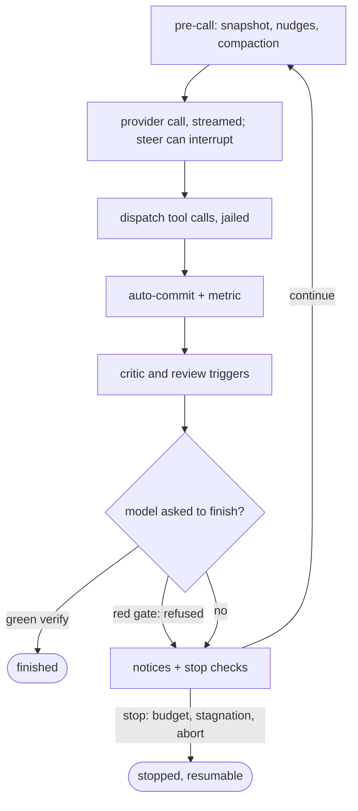

# Internals

Maps of the code as it is today. The call graphs are built from the current
source at site-build time (`docs/gen_diagrams.py`), so they cannot drift;
the one flow chart is curated by hand and marked so. Click any diagram to
pan and zoom it. [architecture.md](architecture.md) explains the design
these shapes serve.

## The module layering

Top-level packages, collapsed from the `tach` module graph. The engine stack
is `ui -> app -> workflows -> tools -> sandbox` (an edge here is "imports
from"); the shared substrate holds the leaf packages any layer may use.

<!-- diagram: layering -->

## The agent loop's turn pipeline

The drive tier of `workflows/loop.py`: `run`/`resume` enter `_drive_loop`,
which runs the phases once per model turn — snapshot, compact when needed,
call the model, dispatch its tool calls, auto-commit, then the gates,
notices, and stop checks decide continue-or-end. Extracted from the direct
calls between the phase methods; deeper tiers regenerate from source with
the same extractor.

<!-- diagram: turn-pipeline -->

## The turn, as a flow

Curated, not generated: the branch structure below is maintained by hand
against the same drive tier and reviewed with changes to it. The call graph
above shows who calls whom; this shows the order and the decisions.

## The run lifecycle

`app/run.py`'s `run_task` composes the stage functions: config clamp and
refusals, isolation selection, git preflight, gate inference, manifest,
provider and tool assembly, then the loop, then finalize (stash recovery,
auto-merge, the end report, the notify hook).

<!-- diagram: run-lifecycle -->

## Tool dispatch

Every LLM tool call enters `dispatch`: audit events wrap it, the mode
backstop refuses out-of-surface names, and the handler table routes the
call (dashed edges: reached via the table, not direct calls). Commands and
verify run jailed; file tools resolve through the workspace boundary.

<!-- diagram: tool-dispatch -->
