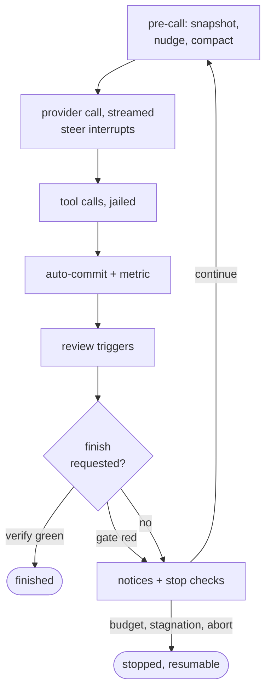

# Internals

Maps of the code as it is today, built from the current source at site-build
time (`docs/gen_diagrams.py`), so they cannot drift. One flow chart is drawn
by hand and says so. [architecture.md](architecture.md) explains the design
these shapes serve.

## The module layering

The engine stack, from `tach`'s module graph. An edge is "imports from", and
every layer may import any layer below it, so the chain is the rule; a
dashed edge would mark an import climbing it.

<!-- diagram: layering -->

Any layer may also use the shared substrate: <!-- generated: substrate-names -->.

## The turn, as a flow

Drawn by hand against `workflows/loop.py`'s drive tier and reviewed with
changes to it: the order of a turn and the decisions that end it.

## The run lifecycle

`app/run.py`'s `run_task` composes one stage per step, drawn in the order it
calls them: refusals and clamps, isolation, git preflight, manifest,
provider and tool assembly, gate inference, the loop, then auto-merge and
the end report. The stash finalize is last because it runs from `finally`,
on every exit path, refusals included.

<!-- diagram: run-lifecycle -->

## Tool dispatch

Every LLM tool call passes the same gates: audit events wrap it, the mode
backstop refuses an out-of-surface name, MCP calls take an approval, and the
handler table routes the rest by name. Commands and verify run jailed; file
tools resolve through the workspace boundary.

<!-- diagram: tool-dispatch -->

The table routes <!-- generated: tool-names -->.
